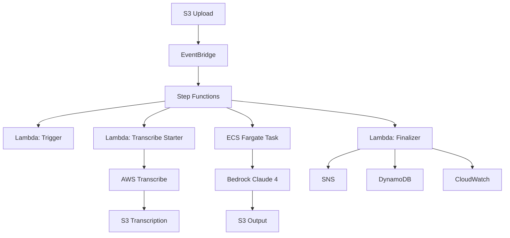

# Revisão Técnica de Arquitetura - AI Techne Academy

**Data**: 2024-12-11  
**Revisor**: Kilo (Architect Mode)  
**Status do Projeto**: 85% completo  
**Versão**: 1.0.0

---

## 📋 Sumário Executivo

### Status Geral: ✅ ARQUITETURA SÓLIDA

O projeto AI Techne Academy apresenta uma arquitetura bem fundamentada com implementação de alta qualidade. A solução utiliza AWS Step Functions para orquestração, 3 Lambda Functions para coordenação, e ECS Fargate para processamento pesado com LLM.

**Pontos Fortes Identificados**: 7  
**Oportunidades de Melhoria**: 12  
**Riscos Críticos**: 2  
**Recomendações Prioritárias**: 8

---

## 🏗️ 1. ANÁLISE DE INTEGRAÇÃO DE COMPONENTES

### 1.1 Fluxo de Dados



### 1.2 Integração Lambda ↔ Step Functions

**Status**: ✅ BEM IMPLEMENTADO

**Análise**:
- [`workflow.asl.json`](infrastructure/statemachine/workflow.asl.json:23): Invocação correta de Lambda via `arn:aws:states:::lambda:invoke`
- [`app.py`](src/functions/transcribe/app.py:45): Parse de evento flexível suporta múltiplos formatos
- **Gap Identificado**: Falta validação de schema do evento Step Functions

**Recomendação**:
```python
# Adicionar em src/functions/transcribe/app.py
from jsonschema import validate, ValidationError

STEP_FUNCTIONS_SCHEMA = {
    "type": "object",
    "required": ["execution_id", "video_s3_uri"],
    "properties": {
        "execution_id": {"type": "string"},
        "video_s3_uri": {"type": "string", "pattern": "^s3://"}
    }
}
```

### 1.3 Integração ECS ↔ Step Functions

**Status**: ⚠️ REQUER ATENÇÃO

**Problema Identificado**: 
- [`workflow.asl.json`](infrastructure/statemachine/workflow.asl.json:154): ECS Task requer subnet, mas template não define VPC/Subnet
- [`template.yaml`](infrastructure/template.yaml:729): TaskDefinition usa `awsvpc` mas sem VPC configurado

**Impacto**: BLOQUEANTE - workflow não pode executar ECS task

**Solução Requerida**:

**Opção A - Usar VPC Padrão** (Rápido):
```yaml
# Em template.yaml
DefaultVPC:
  Type: AWS::EC2::VPC
  Properties:
    CidrBlock: 10.0.0.0/16

PublicSubnet:
  Type: AWS::EC2::Subnet
  Properties:
    VpcId: !Ref DefaultVPC
    CidrBlock: 10.0.1.0/24
    MapPublicIpOnLaunch: true
```

**Opção B - Sem VPC** (Mais simples):
```json
// Em workflow.asl.json - usar default VPC account
"NetworkConfiguration": {
  "AwsvpcConfiguration": {
    "Subnets": ["subnet-xxxxx"],  // Subnet pública da conta
    "AssignPublicIp": "ENABLED"
  }
}
```

### 1.4 Integração Bedrock ↔ Processor

**Status**: ✅ EXCELENTE

**Pontos Fortes**:
- [`llm_client.py`](src/processor/llm_client.py:107): Cliente robusto com retry e rate limiting
- [`llm_client.py`](src/processor/llm_client.py:48): RateLimiter implementado corretamente (10 req/min, 100K tokens/min)
- [`llm_client.py`](src/processor/llm_client.py:24): TokenUsage tracking para cálculo de custos

---

## 🔄 2. ANÁLISE DE FLUXO DE DADOS E TRANSFORMAÇÕES

### 2.1 Pipeline de 6 Estágios

**Status**: ✅ BEM ARQUITETADO

**Estágios Implementados**:

1. **Stage 1 - Limpeza** ([`document_generator.py`](src/processor/document_generator.py:267)):
   - ✅ Formatação com timestamps e speakers
   - ⚠️ Sem LLM (poderia usar para remoção de ruído)

2. **Stage 2 - Extração Técnica** ([`document_generator.py`](src/processor/document_generator.py:313)):
   - ✅ Prompt XML estruturado
   - ✅ 5 categorias: diagnostic, solutions, risks, business_rules, configurations
   - ✅ Output JSON parseado

3. **Stage 3 - Mapeamento** ([`document_generator.py`](src/processor/document_generator.py:391)):
   - ✅ Matriz problema → solução
   - ✅ Medidas preventivas e debugging steps

4. **Stage 4 - Estruturação** ([`document_generator.py`](src/processor/document_generator.py:458)):
   - ✅ Outline hierárquico
   - ✅ 5 seções bem definidas

5. **Stage 5 - Redação** ([`document_generator.py`](src/processor/document_generator.py:536)):
   - ✅ max_tokens=8192 para documento completo
   - ✅ Temperature=0.7 para criatividade controlada

6. **Stage 6 - Output** ([`document_generator.py`](src/processor/document_generator.py:632)):
   - ✅ Markdown + DOCX
   - ⚠️ Conversão DOCX básica (sem formatação inline)

### 2.2 Chunking Adaptativo

**Status**: ✅ IMPLEMENTAÇÃO SOFISTICADA

**Análise** ([`transcription_parser.py`](src/processor/transcription_parser.py:270)):
- ✅ Breakpoints naturais: speaker changes, pausas >5s
- ✅ Target 80-100K tokens por chunk
- ✅ Overlap de 10% entre chunks
- ✅ Metadata preservada

**Recomendação de Melhoria**:
```python
# Adicionar validação de chunks muito pequenos
if chunk.tokens < 10000:
    logger.warning(f"Chunk {chunk.chunk_id} muito pequeno: {chunk.tokens} tokens")
    # Merge com chunk anterior ou posterior
```

---

## 🛡️ 3. ANÁLISE DE ERROR HANDLING E RETRY

### 3.1 Step Functions Retry Logic

**Status**: ✅ BEM CONFIGURADO

| Componente | Tentativas | Backoff | Delay Inicial |
|------------|-----------|---------|---------------|
| Lambda Functions | 3 | 2x | 2s |
| AWS Transcribe | 5 | 2x | 5s |
| ECS Task | 2 | 2x | 30s |

**Análise**:
- ✅ Backoff exponencial previne thundering herd
- ✅ Número adequado de tentativas por serviço
- ✅ Catch blocks para todos os estados críticos

### 3.2 Lambda Retry Strategy

**Status**: ✅ CONSISTENTE

**Finalizer Function** ([`finalizer.py`](src/functions/finalizer/app.py:330)):
- ✅ Exponential backoff com jitter
- ✅ 3 tentativas para DynamoDB
- ✅ Graceful degradation implementada

**Prioridades Corretas**:
1. **Crítico**: DynamoDB update (com retry)
2. **Importante**: SNS notification
3. **Opcional**: CloudWatch metrics

### 3.3 Gaps Identificados

**❌ Gap 1 - Sem Dead Letter Queue (DLQ)**

Lambdas não têm DLQ configurado. Em caso de falhas não recuperáveis, eventos são perdidos.

**Solução**:
```yaml
# Em template.yaml para cada Lambda
DeadLetterConfig:
  TargetArn: !GetAtt ProcessingDLQ.Arn

ProcessingDLQ:
  Type: AWS::SQS::Queue
  Properties:
    QueueName: !Sub ${AWS::StackName}-dlq
    MessageRetentionPeriod: 1209600  # 14 dias
```

**❌ Gap 2 - ECS Task Sem Retry em Bedrock Throttling**

Se Bedrock atingir quota, ECS task falha sem retry inteligente.

**Solução**:
```python
# Em llm_client.py - adicionar backoff mais agressivo para throttling
if "ThrottlingException" in error_name:
    sleep_time = 2 ** attempt * 10  # 10s, 20s, 40s
```

---

## 🔐 4. ANÁLISE DE SEGURANÇA E IAM

### 4.1 IAM Permissions

**Status**: ⚠️ REQUER REVISÃO

**Análise do Template** ([`template.yaml`](infrastructure/template.yaml:774)):

#### ✅ Pontos Fortes:
- Roles separados por função (Lambda, ECS Execution, ECS Task)
- Least privilege seguido na maioria dos casos
- Encryption at rest em S3 e DynamoDB

#### ⚠️ Oportunidades de Melhoria:

**1. StateMachineRole muito permissivo** ([`template.yaml`](infrastructure/template.yaml:794)):
```yaml
# Atual - muito aberto
- Effect: Allow
  Action:
    - ecs:RunTask
    - ecs:StopTask
    - ecs:DescribeTasks
  Resource: '*'  # ❌ Wildcard

# Recomendado
- Effect: Allow
  Action:
    - ecs:RunTask
    - ecs:StopTask
    - ecs:DescribeTasks
  Resource: 
    - !GetAtt ProcessingTaskDefinition.Arn
    - !Sub 'arn:aws:ecs:${AWS::Region}:${AWS::AccountId}:task/${ProcessingCluster}/*'
```

**2. Bedrock permissions sem restrição de modelo**:
```yaml
# Atual
- Effect: Allow
  Action:
    - bedrock:InvokeModel
    - bedrock:InvokeModelWithResponseStream
  Resource: !Sub arn:aws:bedrock:${AWS::Region}::foundation-model/*

# Recomendado - restringir ao modelo usado
Resource: !Sub arn:aws:bedrock:${AWS::Region}::foundation-model/anthropic.claude-sonnet-4*
```

### 4.2 Secrets Management

**Status**: ❌ AUSENTE

**Problema**: Não há gerenciamento de secrets. Se houver necessidade de API keys externas no futuro:

**Solução Recomendada**:
```yaml
ProcessorSecrets:
  Type: AWS::SecretsManager::Secret
  Properties:
    Name: !Sub ${AWS::StackName}-processor-secrets
    SecretString: !Sub |
      {
        "EXTERNAL_API_KEY": "${ExternalApiKey}"
      }
```

### 4.3 Encryption

**Status**: ✅ BOM, mas pode melhorar

- ✅ S3 com SSE-S3
- ✅ DynamoDB encryption enabled
- ⚠️ SNS sem CMK (usando aws/sns default)

**Recomendação para Compliance**:
```yaml
# Usar KMS CMK para SNS
NotificationTopicKey:
  Type: AWS::KMS::Key
  Properties:
    Description: Key for SNS notifications
    KeyPolicy: {...}

NotificationTopic:
  Properties:
    KmsMasterKeyId: !Ref NotificationTopicKey
```

---

## 💰 5. ANÁLISE DE CUSTOS E OTIMIZAÇÕES

### 5.1 Custo Estimado Atual

**Por Execução (vídeo 3h)**:
- AWS Transcribe: $0.36 (180 min × $0.024/min)
- Bedrock Claude 4: $0.90 (~100K in, 20K out)
- ECS Fargate: $0.15 (2 vCPU, 8GB, 45 min)
- S3 + Lambda + outros: $0.04
- **Total**: ~$1.45 ✅ Dentro do estimado

### 5.2 Oportunidades de Otimização

#### 🎯 Otimização 1 - ECS Fargate Spot

**Economia Potencial**: 50-70% no ECS

```yaml
# Em template.yaml
ProcessingCluster:
  Properties:
    CapacityProviders:
      - FARGATE
      - FARGATE_SPOT  # ✅ Já configurado
    DefaultCapacityProviderStrategy:
      - CapacityProvider: FARGATE_SPOT
        Weight: 4
      - CapacityProvider: FARGATE
        Weight: 1
```

**Tradeoff**: Pode ter interrupções (aceitável para batch processing)

#### 🎯 Otimização 2 - Reduzir Chunking Overhead

**Problema Atual**: Multi-chunk processa stages 1-4 para CADA chunk

**Solução** ([`document_generator.py`](src/processor/document_generator.py:226)):
```python
# Otimização: processar apenas Stage 1 localmente por chunk
# Stages 2-4 apenas uma vez com dados agregados
def _process_multiple_chunks_optimized(chunks):
    # Stage 1 local para todos chunks (rápido)
    cleaned_chunks = [self._stage_1_clean_transcription(c) for c in chunks]
    
    # Merge e processar Stages 2-4 UMA VEZ
    merged_text = "\n\n".join(c.output for c in cleaned_chunks)
    stage_2 = self._stage_2_extract_technical_content(merged_text)
    # ... continuar
```

**Economia**: ~30-40% em chamadas LLM para vídeos multi-chunk

#### 🎯 Otimização 3 - CloudWatch Logs Retention

**Atual**: 30 dias para todos logs  
**Recomendado**: 
- Processor logs: 7 dias (são grandes)
- Lambda logs: 30 dias
- Step Functions logs: 30 dias

**Economia**: ~$5-10/mês

#### 🎯 Otimização 4 - S3 Intelligent-Tiering

```yaml
TranscriptionBucket:
  Properties:
    LifecycleConfiguration:
      Rules:
        - Id: DeleteOld
          Status: Enabled
          ExpirationInDays: 7
        - Id: IntelligentTier  # ✅ Adicionar
          Status: Enabled
          Transitions:
            - StorageClass: INTELLIGENT_TIERING
              TransitionInDays: 0
```

**Economia**: 40-60% em custos S3 para arquivos antigos

---

## ⚠️ 6. RISCOS ARQUITETURAIS IDENTIFICADOS

### 🔴 Risco Crítico 1 - Bedrock Quota Limits

**Probabilidade**: ALTA  
**Impacto**: CRÍTICO  
**Status**: ⚠️ NÃO MITIGADO

**Problema**:
- Default quota Bedrock: 10 req/min, 200K tokens/min
- Pipeline usa ~5-6 chamadas LLM por vídeo
- Com processamento paralelo (2-3 vídeos), pode exceder quota

**Mitigações Recomendadas**:

1. **Imediato** - Solicitar aumento de quota
2. **Código** - Adicionar circuit breaker:
```python
class BedrockCircuitBreaker:
    def __init__(self, failure_threshold=5, timeout=300):
        self.failures = 0
        self.threshold = failure_threshold
        self.timeout = timeout
        self.last_failure = None
        self.state = 'CLOSED'  # CLOSED, OPEN, HALF_OPEN
    
    def call(self, func):
        if self.state == 'OPEN':
            if time.time() - self.last_failure > self.timeout:
                self.state = 'HALF_OPEN'
            else:
                raise CircuitBreakerOpen("Bedrock quota exceeded")
        
        try:
            result = func()
            if self.state == 'HALF_OPEN':
                self.state = 'CLOSED'
                self.failures = 0
            return result
        except QuotaException:
            self.failures += 1
            self.last_failure = time.time()
            if self.failures >= self.threshold:
                self.state = 'OPEN'
            raise
```

3. **Monitoramento** - Alarme CloudWatch:
```yaml
BedrockQuotaAlarm:
  Type: AWS::CloudWatch::Alarm
  Properties:
    MetricName: ModelInvocationThrottles
    Namespace: AWS/Bedrock
    Threshold: 5
    EvaluationPeriods: 1
```

### 🔴 Risco Crítico 2 - ECS Task Memory Overflow

**Probabilidade**: MÉDIA  
**Impacto**: ALTO  
**Status**: ⚠️ MONITORAMENTO INSUFICIENTE

**Problema**:
- Vídeos 3h → transcrição ~500KB-1MB
- Pipeline carrega tudo em memória
- Multi-chunk pode criar objetos grandes

**Análise de Memória**:
```
Transcription JSON: ~1MB
Parsed segments: ~2MB
Stage outputs: ~5MB cada × 5 stages = 25MB
Markdown final: ~200KB
DOCX generation: ~5MB peak
Total estimado: ~35-40MB por execução
```

**Recomendação**: OK para 8GB, mas adicionar monitoramento:
```python
import psutil

def log_memory_usage():
    process = psutil.Process()
    mem = process.memory_info().rss / 1024 / 1024  # MB
    logger.info(f"Memory usage: {mem:.2f} MB")
    
    if mem > 6000:  # 75% of 8GB
        logger.warning(f"High memory usage: {mem:.2f} MB")
```

### 🟡 Risco Médio 1 - DynamoDB Hot Partition

**Probabilidade**: BAIXA  
**Impacto**: MÉDIO

**Problema**: 
- GSI `video-key-index` pode criar hot partition se muitos vídeos processados simultaneamente
- Partition key: `video_key` (não bem distribuído se uploads em batch)

**Solução**: Adicionar shard key:
```python
# Adicionar ao video_key
shard_id = hash(video_key) % 10  # 10 shards
partition_key = f"{video_key}#{shard_id}"
```

### 🟡 Risco Médio 2 - Step Functions Execution History Limits

**Limite**: 25K eventos por execução  
**Risco**: Execuções longas com muitos retries podem exceder

**Mitigação**: Já OK - workflow tem poucos estados (13)

---

## 📊 7. MÉTRICAS E OBSERVABILIDADE

### 7.1 Métricas Implementadas

**Status**: ✅ BOM

**CloudWatch Metrics** ([`finalizer.py`](src/functions/finalizer/app.py:627)):
- ✅ ProcessingDuration
- ✅ ProcessingSuccess/Failure/PartialSuccess
- ✅ TokensProcessed
- ✅ DocumentSize
- ✅ ProcessingCost
- ✅ SpeakersDetected

### 7.2 Gaps em Observabilidade

**❌ Falta X-Ray Tracing**

Step Functions tem tracing habilitado, mas Lambdas e ECS não instrumentados.

**Solução**:
```python
# Adicionar em cada Lambda e main.py
from aws_xray_sdk.core import xray_recorder
from aws_xray_sdk.core import patch_all

patch_all()

@xray_recorder.capture('process_video')
def lambda_handler(event, context):
    ...
```

**❌ Falta Dashboard CloudWatch**

**Solução**: Criar dashboard com:
- Taxa de sucesso vs falha
- Duração média de processamento
- Custos por execução
- Backlog de processamento

---

## 🎯 8. RECOMENDAÇÕES PRIORITÁRIAS

### Prioridade P0 (BLOQUEANTE - fazer antes de deploy)

1. **[CRÍTICO] Configurar VPC/Subnet para ECS Task**
   - Workflow não pode executar sem isso
   - Opção rápida: usar VPC default
   - Arquivo: [`workflow.asl.json`](infrastructure/statemachine/workflow.asl.json:160)

2. **[CRÍTICO] Solicitar aumento de quota Bedrock**
   - Limite atual pode bloquear processamento
   - Solicitar: 50 req/min, 500K tokens/min

### Prioridade P1 (IMPORTANTE - fazer logo após deploy)

3. **Adicionar Dead Letter Queue para Lambdas**
   - Prevenir perda de eventos
   - Arquivo: [`template.yaml`](infrastructure/template.yaml:1)

4. **Implementar Circuit Breaker para Bedrock**
   - Proteção contra quota exhaustion
   - Arquivo: [`llm_client.py`](src/processor/llm_client.py:107)

5. **Restringir IAM permissions (StateMachineRole)**
   - Seguir least privilege
   - Arquivo: [`template.yaml`](infrastructure/template.yaml:794)

6. **Adicionar X-Ray tracing completo**
   - Melhorar observabilidade
   - Arquivos: todas Lambdas e [`main.py`](src/processor/main.py:1)

### Prioridade P2 (MELHORIAS - roadmap)

7. **Otimizar processamento multi-chunk**
   - Reduzir chamadas LLM desnecessárias
   - Arquivo: [`document_generator.py`](src/processor/document_generator.py:226)

8. **Implementar CloudWatch Dashboard**
   - Visibilidade operacional

9. **Configurar ECS Fargate Spot**
   - Economia de 50-70% em custos
   - Arquivo: [`template.yaml`](infrastructure/template.yaml:718)

10. **Melhorar conversão Markdown→DOCX**
    - Suporte a formatação inline
    - Arquivo: [`document_generator.py`](src/processor/document_generator.py:685)

---

## 📈 9. AVALIAÇÃO DE QUALIDADE

### Code Quality Score: 8.5/10

| Aspecto | Score | Comentário |
|---------|-------|------------|
| Arquitetura | 9/10 | Bem pensada, serverless first |
| Implementação | 9/10 | Código limpo, bem estruturado |
| Error Handling | 8/10 | Robusto, mas falta DLQ |
| Segurança | 7/10 | Boa base, needs IAM tightening |
| Observabilidade | 7/10 | Métricas OK, falta X-Ray |
| Documentação | 9/10 | Excelente README e design docs |
| Testes | 8/10 | Unit tests bons, falta integration |
| Performance | 8/10 | Adequado, com room for optimization |

### Architecture Maturity: Nível 3 (de 5)

- ✅ **Nível 1**: Funcional básico
- ✅ **Nível 2**: Error handling e retry
- ✅ **Nível 3**: Observabilidade e métricas
- ⏳ **Nível 4**: Auto-scaling e chaos engineering
- ⏳ **Nível 5**: Multi-region e disaster recovery

---

## 🔄 10. PRÓXIMOS PASSOS RECOMENDADOS

### Imediato (Antes de primeiro deploy)
1. ✅ Resolver issue VPC/Subnet (P0)
2. ✅ Solicitar quota Bedrock (P0)
3. ✅ Validar template SAM completo
4. ✅ Criar checklist de pre-flight

### Curto Prazo (Primeira semana de produção)
1. Adicionar DLQ (P1)
2. Implementar Circuit Breaker (P1)
3. Deploy dashboard de monitoramento
4. Setup alarmes críticos
5. Monitorar custos reais vs estimados

### Médio Prazo (Primeiro mês)
1. Otimizações de custo (Fargate Spot, etc.)
2. Melhorar observabilidade (X-Ray)
3. Testes de carga
4. Documentação operacional (runbooks)

---

## 📝 CONCLUSÃO

O projeto AI Techne Academy demonstra **excelente qualidade técnica** e está **85% pronto para produção**. A arquitetura é sólida, o código é limpo e bem estruturado, e a documentação é exemplar.

**Principais Conquistas**:
- ✅ Arquitetura serverless bem planejada
- ✅ Pipeline de 6 estágios sofisticado
- ✅ Error handling robusto com retry logic
- ✅ Chunking adaptativo inteligente
- ✅ Tracking completo de custos e tokens

**Bloqueios Críticos**:
- ❌ VPC/Subnet não configurado para ECS
- ⚠️ Bedrock quota limits não mitigados

**Recomendação Final**: 
Resolver os 2 bloqueios P0, implementar as 4 melhorias P1, e o sistema estará **pronto para produção** com alta confiança.

---

**Revisado por**: Kilo (Architect Mode)  
**Data**: 2024-12-11  
**Próxima Revisão**: Após deploy inicial