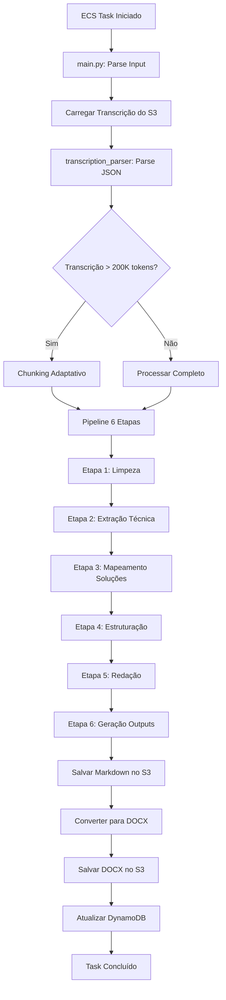

# Processador ECS - Design Técnico Detalhado

**Versão**: 1.0.0  
**Data**: 2024-12-11  
**Status**: Em Desenvolvimento  
**Componente**: ECS Fargate Task - Processamento Principal

---

## 📋 Índice

1. [Visão Geral](#visão-geral)
2. [Arquitetura](#arquitetura)
3. [Pipeline de 6 Etapas](#pipeline-de-6-etapas)
4. [Componentes Detalhados](#componentes-detalhados)
5. [Integração AWS Bedrock](#integração-aws-bedrock)
6. [Chunking Adaptativo](#chunking-adaptativo)
7. [Geração de Documentos](#geração-de-documentos)
8. [Estrutura de Inputs/Outputs](#estrutura-de-inputsoutputs)
9. [Error Handling](#error-handling)
10. [Testes](#testes)
11. [Implementação](#implementação)

---

## Visão Geral

### Objetivo

O Processador ECS é o **componente central** do sistema AI Techne Academy. Ele recebe transcrições do AWS Transcribe, processa o conteúdo usando AWS Bedrock (Claude Sonnet 4), e gera documentos de treinamento técnico em formatos Markdown e DOCX.

### Responsabilidades

1. **Parse de Transcrições**: Ler e processar JSON do AWS Transcribe
2. **Chunking Inteligente**: Dividir transcrições longas (>200K tokens)
3. **Processamento LLM**: Invocar Claude Sonnet 4 via AWS Bedrock usando LangChain
4. **Pipeline de 6 Etapas**: Executar workflow de geração de documentos
5. **Geração de Outputs**: Criar documentos Markdown e DOCX
6. **Upload S3**: Salvar documentos no bucket de output
7. **Tracking**: Atualizar DynamoDB com progresso e resultados

### Tecnologias

- **Runtime**: Python 3.12
- **Container**: Docker (Alpine-based)
- **Orquestração**: ECS Fargate (2 vCPU, 8GB RAM)
- **LLM Client**: LangChain + AWS Bedrock
- **Formato Saída**: Markdown + DOCX (python-docx)
- **AWS Services**: S3, Bedrock, DynamoDB, CloudWatch

---

## Arquitetura

### Diagrama de Componentes

```
┌─────────────────────────────────────────────────────────────┐
│                    ECS Fargate Task                          │
│  ┌────────────────────────────────────────────────────────┐ │
│  │                   main.py                               │ │
│  │  (Entry Point & Orchestration)                          │ │
│  └───────────┬────────────────────────────────────────────┘ │
│              │                                               │
│              ├──────────────┬──────────────┬────────────┐   │
│              │              │              │            │   │
│  ┌───────────▼────┐ ┌──────▼──────┐ ┌────▼────┐ ┌────▼──┐ │
│  │ transcription_ │ │ llm_client  │ │document_│ │ utils │ │
│  │   parser.py    │ │   .py       │ │generator│ │  .py  │ │
│  └────────────────┘ └─────────────┘ └─────────┘ └───────┘ │
│                                                              │
│  Dependencies:                                               │
│  • boto3 (S3, DynamoDB)                                      │
│  • langchain-aws (BedrockChat)                               │
│  • python-docx (DOCX generation)                             │
│  • tiktoken (token counting)                                 │
└──────────────────────────────────────────────────────────────┘
         │                    │                    │
         │ Read               │ Invoke             │ Write
         ▼                    ▼                    ▼
    ┌────────┐          ┌──────────┐         ┌────────┐
    │   S3   │          │ Bedrock  │         │   S3   │
    │(Input) │          │(Claude)  │         │(Output)│
    └────────┘          └──────────┘         └────────┘
         │                                        │
         └──────────────┬─────────────────────────┘
                        ▼
                  ┌──────────┐
                  │ DynamoDB │
                  │(Tracking)│
                  └──────────┘
```

### Fluxo de Execução



---

## Pipeline de 6 Etapas

### Etapa 1: Análise e Limpeza da Transcrição

**Objetivo**: Preparar a transcrição para processamento.

**Operações**:
- Parse do JSON do AWS Transcribe
- Extração de texto e timestamps
- Identificação de speakers (spk_0, spk_1, etc.)
- Remoção de ruído:
  - Cumprimentos e saudações genéricas
  - Pausas para café/banheiro
  - Problemas técnicos (áudio, conexão)
  - Conversas não técnicas
- Segmentação por tópicos/timestamps

**Input**: JSON do Transcribe
**Output**: Texto limpo com speakers e timestamps

**Implementação**: `transcription_parser.py`

---

### Etapa 2: Extração de Conteúdo Técnico

**Objetivo**: Identificar e extrair todos os elementos técnicos relevantes.

**Prompt Base**:

```xml
<task>
Você é um Especialista em Documentação Técnica de Software. Analise a transcrição fornecida e extraia conteúdo técnico.
</task>

<instructions>
Ignore diálogos sociais. Concentre-se exclusivamente no conteúdo técnico e extraia:

1. <diagnostic>
   Liste erros específicos (códigos, mensagens, exceções).
   Para cada erro, identifique a causa raiz explicada.
</diagnostic>

2. <solutions>
   Descreva passos técnicos executados.
   Inclua comandos, alterações de código, configurações.
</solutions>

3. <risks>
   Identifique avisos sobre ambientes compartilhados, concorrência, 
   procedimentos que afetam outros membros da equipe.
</risks>

4. <business_rules>
   Extraia explicações sobre comportamento do sistema.
   Por que dados aparecem com valor X ou Y?
</business_rules>

5. <configurations>
   Liste convenções de nomenclatura (prefixos, sufixos).
   Configurações específicas de ferramentas.
</configurations>
</instructions>

<output_format>
Gere um JSON estruturado contendo os 5 elementos acima.
Use listas para múltiplos itens em cada categoria.
</output_format>

<transcription>
{TRANSCRIPTION_TEXT}
</transcription>
```

**Input**: Texto limpo da Etapa 1  
**Output**: JSON estruturado com 5 categorias técnicas

---

### Etapa 3: Mapeamento de Soluções

**Objetivo**: Criar relação clara entre problemas e soluções.

**Prompt Base**:

```xml
<task>
Você é um Engenheiro de Software Sênior. Crie um mapeamento entre problemas e soluções.
</task>

<instructions>
Com base no conteúdo técnico extraído, crie uma matriz problema-solução:

1. <problem_solution_map>
   Para cada erro/problema identificado:
   - Código/mensagem do erro
   - Causa raiz
   - Solução aplicada (passo a passo)
   - Comandos executados
   - Resultado obtido
</problem_solution_map>

2. <preventive_measures>
   Liste medidas preventivas mencionadas.
   Como evitar o problema no futuro?
</preventive_measures>

3. <debugging_steps>
   Passos de debug/investigação mencionados.
   Como diagnosticar o problema?
</debugging_steps>
</instructions>

<output_format>
Gere um JSON estruturado com os 3 elementos acima.
Organize de forma hierárquica (problema → causa → solução).
</output_format>

<technical_content>
{EXTRACTED_CONTENT_FROM_STAGE_2}
</technical_content>
```

**Input**: JSON da Etapa 2  
**Output**: JSON com mapeamento problema-solução

---

### Etapa 4: Estruturação do Documento

**Objetivo**: Criar a estrutura lógica do documento final.

**Prompt Base**:

```xml
<task>
Você é um Designer Instrucional Técnico. Crie a estrutura para um Guia de Treinamento e Troubleshooting.
</task>

<instructions>
Organize os tópicos da seguinte forma:

1. <troubleshooting_section>
   - Comparação entre tipos de erros (Compilação vs Runtime vs Configuração)
   - Cada erro associado à sua solução imediata
   - Sintomas e diagnóstico
</troubleshooting_section>

2. <practical_procedure>
   - Passo a passo da solução técnica
   - Seção específica: 'Instrumentação e Debug'
   - Como rastrear o problema
   - Comandos e ferramentas utilizadas
</practical_procedure>

3. <safety_protocols>
   - Cuidados com ambiente compartilhado
   - Como não impactar colegas
   - Seção destacada como CRÍTICA
</safety_protocols>

4. <business_understanding>
   - Interpretação dos resultados
   - Explicação de regras de negócio
   - Por que o sistema se comporta assim?
</business_understanding>

5. <faq_section>
   - Dúvidas comuns encontradas
   - Respostas objetivas
</faq_section>
</instructions>

<output_format>
Gere apenas a estrutura (outline) em formato hierárquico.
Use bullet points detalhando o que será abordado em cada seção.
NÃO escreva o conteúdo completo ainda.
</output_format>

<mapped_solutions>
{SOLUTION_MAP_FROM_STAGE_3}
</mapped_solutions>
```

**Input**: JSON da Etapa 3  
**Output**: Outline estruturado

---

### Etapa 5: Redação do Conteúdo

**Objetivo**: Escrever o documento completo em Markdown.

**Prompt Base**:

```xml
<task>
Atue como um Redator Técnico Sênior. Escreva um Documento de Treinamento e Troubleshooting completo em Markdown.
</task>

<guidelines>
- Tom: Profissional, instrucional, direto (imperativo: 'Faça', 'Configure', 'Verifique')
- Clareza: Acessível para iniciantes. Explique o 'porquê', não apenas o 'como'
- Formatação: Use code blocks, negrito para ênfase, blockquotes para avisos críticos
</guidelines>

<required_structure>
# 1. Introdução
- Contexto: por que este documento existe?
- Qual problema/tema está sendo abordado?
- Objetivo final para o leitor

# 2. Desenvolvimento
## 2.1 Conceitos-chave
## 2.2 Troubleshooting Guide
## 2.3 Procedimento Passo a Passo
## 2.4 Melhores Práticas
## 2.5 Considerações de Segurança
## 2.6 Entendendo os Dados (Regras de Negócio)

# 3. Encerramento
- Resumo do que foi aprendido
- Reforço da mensagem principal
- Próximos passos/ações

# 4. FAQ
- Dúvidas comuns
- Respostas objetivas e claras
</required_structure>

<document_outline>
{OUTLINE_FROM_STAGE_4}
</document_outline>
```

**Input**: Outline da Etapa 4  
**Output**: Documento Markdown completo

---

### Etapa 6: Geração de Outputs

**Objetivo**: Salvar documentos em múltiplos formatos.

**Operações**:

1. **Salvar Markdown**: `s3://{output_bucket}/{execution_id}/document.md`
2. **Converter para DOCX**: Usando `python-docx`
3. **Salvar DOCX**: `s3://{output_bucket}/{execution_id}/document.docx`
4. **Validação**: Tamanho mínimo, estrutura válida

**Input**: Markdown da Etapa 5  
**Output**: Arquivos `.md` e `.docx` no S3

---

## Componentes Detalhados

### 1. transcription_parser.py

```python
class TranscriptionParser:
    """Parser para transcrições do AWS Transcribe."""
    
    def __init__(self, s3_client):
        self.s3_client = s3_client
        
    def parse_transcribe_json(self, json_data: dict) -> dict:
        """Parse do JSON do AWS Transcribe."""
        
    def chunk_transcription(self, text: str, max_tokens: int = 100000) -> list:
        """Divide transcrição em chunks inteligentes."""
        
    def count_tokens(self, text: str) -> int:
        """Conta tokens usando tiktoken."""
```

### 2. llm_client.py

```python
from langchain_aws import ChatBedrock

class BedrockLLMClient:
    """Cliente LangChain para AWS Bedrock."""
    
    def __init__(self, model_id: str = "anthropic.claude-sonnet-4-5-20250929-v1:0"):
        self.model = ChatBedrock(
            model_id=model_id,
            region_name="us-east-1",
            model_kwargs={"temperature": 0.7, "max_tokens": 4096}
        )
        
    def invoke(self, prompt: str) -> str:
        """Invoca o modelo com retry logic."""
```

### 3. document_generator.py

```python
class DocumentGenerator:
    """Gerador de documentos usando pipeline de 6 etapas."""
    
    def __init__(self, llm_client, parser, s3_client):
        self.llm = llm_client
        self.parser = parser
        self.s3 = s3_client
        
    def generate_document(self, execution_id: str, 
                         transcription_uri: str,
                         output_bucket: str) -> dict:
        """Executa pipeline completo de 6 etapas."""
```

### 4. main.py

```python
def lambda_handler(event: dict, context) -> dict:
    """Handler principal do processador ECS."""
    
    # Setup
    execution_id = event['execution_id']
    
    # Initialize
    parser = TranscriptionParser(s3_client)
    llm = BedrockLLMClient()
    generator = DocumentGenerator(llm, parser, s3_client)
    
    # Generate
    result = generator.generate_document(execution_id, ...)
    
    return {'statusCode': 200, 'body': result}
```

---

## Integração AWS Bedrock

### Configuração

```python
from langchain_aws import ChatBedrock

chat = ChatBedrock(
    model_id="anthropic.claude-sonnet-4-5-20250929-v1:0",
    region_name="us-east-1",
    model_kwargs={
        "temperature": 0.7,
        "max_tokens": 4096,
        "top_p": 0.95
    }
)
```

### Custos

```python
INPUT_PRICE_PER_1K = 0.003   # $0.003 per 1K tokens
OUTPUT_PRICE_PER_1K = 0.015  # $0.015 per 1K tokens
```

---

## Chunking Adaptativo

### Estratégia

1. Contar tokens totais
2. Se ≤ 100K tokens: processar completo
3. Se > 100K tokens:
   - Identificar breakpoints naturais (mudanças de speaker, pausas)
   - Criar chunks de ~80-100K tokens
   - Overlap de 10K tokens entre chunks
   - Adicionar metadata

### Implementação

```python
def adaptive_chunking(text: str, max_tokens: int = 100000) -> list:
    """Chunking adaptativo baseado em conteúdo."""
    
    total_tokens = count_tokens(text)
    
    if total_tokens <= max_tokens:
        return [{'chunk_id': 0, 'text': text}]
    
    # Multi-chunk logic
    num_chunks = math.ceil(total_tokens / max_tokens)
    return create_chunks_with_overlap(text, num_chunks)
```

---

## Geração de Documentos

### Markdown → DOCX

```python
from docx import Document

class MarkdownToDocxConverter:
    """Converte Markdown para DOCX."""
    
    def convert(self, markdown_text: str) -> Document:
        """
        Suporte para:
        - Headers (# ## ###)
        - Bold (**text**), Italic (*text*)
        - Code blocks (```)
        - Lists (bullet e numeradas)
        - Blockquotes (>)
        - Tables
        """
        doc = Document()
        # Processar linha por linha
        return doc
```

---

## Estrutura de Inputs/Outputs

### Event Input (Step Functions)

```json
{
  "execution_id": "uuid-1234",
  "video_s3_uri": "s3://input-bucket/video.mp4",
  "transcription_s3_uri": "s3://transcripts-bucket/uuid/transcription.json",
  "output_bucket": "output-bucket",
  "tracking_table": "tracking-table-name"
}
```

### Response Output

```json
{
  "statusCode": 200,
  "body": {
    "markdown_s3_uri": "s3://output/uuid/document.md",
    "docx_s3_uri": "s3://output/uuid/document.docx",
    "tokens_used": {
      "input": 150000,
      "output": 8000
    },
    "cost_usd": 0.57,
    "duration_seconds": 185
  }
}
```

---

## Error Handling

### Estratégia

```python
try:
    result = generator.generate_document(...)
except BedrockThrottlingException:
    # Retry com backoff
    retry_with_backoff()
except BedrockValidationException:
    # Erro permanente - não retry
    raise
except Exception as e:
    # Log e notificar
    logger.error(f"Unexpected error: {e}")
    update_tracking_failed()
    raise
```

---

## Testes

### Casos de Teste

1. **Transcrição curta (<100K tokens)**: Processamento direto
2. **Transcrição longa (>200K tokens)**: Chunking e merge
3. **Múltiplos speakers**: Identificação correta
4. **Errors handling**: Retry e fallback
5. **Formato outputs**: Markdown e DOCX válidos

---

## Implementação

### Checklist

- [ ] Implementar `transcription_parser.py`
- [ ] Implementar `llm_client.py`
- [ ] Implementar `document_generator.py`
- [ ] Implementar `main.py`
- [ ] Criar testes unitários (>80% cobertura)
- [ ] Documentar README.md
- [ ] Criar Dockerfile
- [ ] Deploy teste ECS

---

**Última Atualização**: 2024-12-11  
**Autor**: Kilo Code (Architect Mode)  
**Status**: Design Completo - Pronto para Implementação