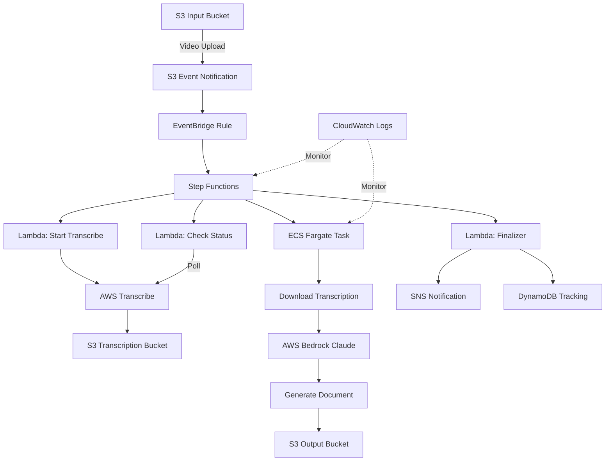
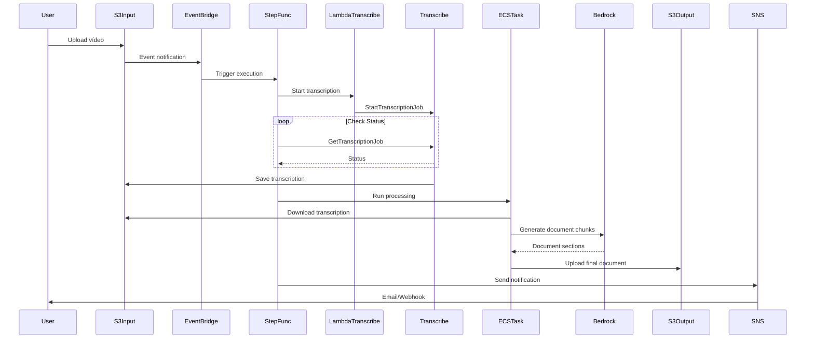
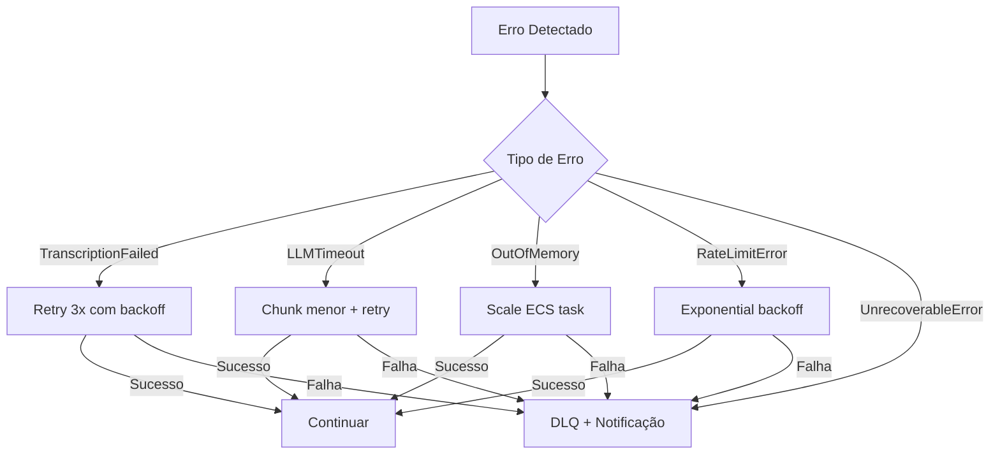

# Especificação Técnica: Sistema de Geração de Documentos de Treinamento a partir de Vídeos

## 1. Visão Geral do Projeto

### 1.1 Objetivo
Criar um sistema serverless/containerizado na AWS que processe automaticamente vídeos de até 3 horas, gerando documentos completos de Treinamento e Troubleshooting a partir da transcrição das chamadas.

### 1.2 Requisitos Funcionais
- ✅ Processar vídeos de até 3 horas de duração
- ✅ Leitura automática de vídeos de um bucket S3 (fila de entrada)
- ✅ Processamento escalável com instâncias dedicadas
- ✅ Geração de documento estruturado de Treinamento e Troubleshooting
- ✅ Armazenamento do resultado em bucket S3 de saída
- ✅ Desenvolvimento e depuração local com AWS SAM e Docker

### 1.3 Requisitos Não-Funcionais
- ⚡ Alta disponibilidade e resiliência
- 📊 Monitoramento e observabilidade completos
- 💰 Otimização de custos com processamento sob demanda
- 🔒 Segurança e controle de acesso via IAM
- 🐳 Containerização para consistência entre ambientes

---

## 2. Arquitetura Proposta

### 2.1 Diagrama de Arquitetura



### 2.2 Componentes da Arquitetura

#### 2.2.1 Armazenamento
- **S3 Input Bucket**: `video-processing-input-{env}`
  - Versionamento habilitado
  - Lifecycle policy: mover para Glacier após 30 dias
  - Event notifications configuradas

- **S3 Output Bucket**: `video-processing-output-{env}`
  - Versionamento habilitado
  - Criptografia em repouso (SSE-S3)

- **S3 Transcription Bucket**: `video-processing-transcripts-{env}`
  - Armazenamento temporário de transcrições
  - Lifecycle policy: deletar após 7 dias

#### 2.2.2 Processamento de Transcrição
- **AWS Transcribe**
  - Speaker identification habilitado (até 10 speakers)
  - Custom vocabulary para termos técnicos
  - Formato de saída: JSON completo com timestamps
  - Language: pt-BR ou auto-detect

#### 2.2.3 Processamento com LLM
- **AWS Bedrock (Claude Sonnet 4)**
  - Modelo: `anthropic.claude-sonnet-4-5-20250929-v1:0`
  - Contexto de até 200k tokens (~3h de transcrição)
  - Streaming para otimização de latência
  - Retry logic para resiliência

#### 2.2.4 Orquestração
- **AWS Step Functions**
  - State machine serverless
  - Retry automático em caso de falhas (3 tentativas)
  - Execução assíncrona
  - Timeout configurável (4 horas para processo completo)
  - Express Workflow para reduzir custos

#### 2.2.5 Computação
- **AWS Lambda**
  - Runtime: Python 3.12
  - Funções leves para iniciar/finalizar processo
  - Timeout: 15 minutos
  - Memory: 1024 MB

- **ECS Fargate**
  - Container Python customizado
  - CPU: 2 vCPU (2048), Memory: 8 GB (8192)
  - Auto-scaling desabilitado (one-off tasks)
  - Timeout: 4 horas
  - Platform version: LATEST

#### 2.2.6 Monitoramento e Observabilidade
- **CloudWatch Logs**: Logs centralizados com retention de 30 dias
- **CloudWatch Metrics**: Métricas customizadas
  - Tempo de processamento por vídeo
  - Taxa de sucesso/falha
  - Custo por execução
- **AWS X-Ray**: Tracing distribuído
- **SNS**: Notificações de erro/conclusão via email/webhook
- **DynamoDB**: Tracking table para auditoria e status

---

## 3. Estrutura do Documento de Saída

### 3.1 Formatos Suportados
- **Formato primário**: Markdown (`.md`)
- **Formato secundário**: HTML (gerado a partir do Markdown)
- **Opcional**: PDF (via Pandoc ou WeasyPrint)

### 3.2 Template do Documento

```markdown
# Documento de Treinamento e Troubleshooting
**Data da Chamada**: {data}
**Duração**: {duração}
**Participantes**: {lista de participantes identificados}

---

## 1. Sumário Executivo
[Resumo de 2-3 parágrafos sobre o tema principal da chamada]

## 2. Tópicos Principais Discutidos
### 2.1 [Tópico 1]
- Descrição detalhada
- Pontos-chave levantados
- Decisões tomadas

### 2.2 [Tópico 2]
[...]

## 3. Procedimentos e Instruções
### 3.1 [Procedimento 1]
**Objetivo**: [descrição]
**Pré-requisitos**: [lista]
**Passos**:
1. [passo 1]
2. [passo 2]
[...]

## 4. Troubleshooting
### 4.1 [Problema 1]
**Sintomas**: [descrição]
**Causa Raiz**: [análise]
**Solução**: [passos detalhados]
**Prevenção**: [recomendações]

## 5. Perguntas e Respostas
[Q&A extraídas da chamada]

## 6. Action Items e Próximos Passos
- [ ] [Item 1]
- [ ] [Item 2]

## 7. Referências e Links
[Documentação mencionada, tickets, etc.]

## 8. Glossário
[Termos técnicos mencionados]

---

## Apêndice A: Transcrição Completa
[Transcrição com timestamps e identificação de speakers]
```

---

## 4. Fluxo de Processamento Detalhado

### 4.1 Diagrama de Fluxo



### 4.2 Fases do Processamento

#### Fase 1: Trigger e Inicialização
1. Usuário faz upload do vídeo para S3 Input Bucket
2. S3 Event Notification dispara EventBridge Rule
3. EventBridge inicia Step Functions State Machine
4. State Machine registra execução inicial no DynamoDB

#### Fase 2: Transcrição do Vídeo
1. Lambda Function inicia AWS Transcribe Job:
   - Media file URI do S3
   - Output bucket para transcrição
   - Language: pt-BR (ou auto-detect)
   - Speaker identification: enabled (max 10 speakers)
   - Formato: JSON com timestamps

2. State Machine entra em estado WAIT:
   - Poll a cada 60 segundos
   - Timeout máximo: 4 horas
   - Retry em caso de erro temporário

3. Quando completo, transcrição é salva no S3 Transcription Bucket

#### Fase 3: Processamento com LLM
1. State Machine inicia ECS Fargate Task com variáveis:
   - `TRANSCRIPTION_S3_URI`: URI da transcrição
   - `OUTPUT_BUCKET`: Bucket de saída
   - `VIDEO_METADATA`: Metadados do vídeo
   - `BEDROCK_MODEL_ID`: ID do modelo Claude

2. Container Python executa pipeline de processamento:
   - **Download**: Recupera transcrição do S3
   - **Pré-processamento**:
     * Limpeza de ruídos
     * Identificação e normalização de speakers
     * Segmentação em chunks se necessário (>180k tokens)
   - **Geração via Bedrock** (6 chamadas ao LLM):
     1. Análise inicial e extração de tópicos
     2. Geração de sumário executivo
     3. Identificação de procedimentos
     4. Extração de troubleshooting
     5. Q&A e action items
     6. Montagem do documento final estruturado
   - **Pós-processamento**:
     * Formatação Markdown
     * Validação de estrutura
     * Geração de HTML (opcional)

3. Upload do documento final para S3 Output Bucket

#### Fase 4: Finalização e Notificação
1. Lambda Function de finalização:
   - Atualiza registro no DynamoDB (status: completed)
   - Registra métricas no CloudWatch
   - Envia notificação SNS com link do documento
   - Limpa recursos temporários (opcional)

2. State Machine finaliza com sucesso

### 4.3 Tratamento de Erros



Estratégias de retry:
- Cada estado tem 3 tentativas configuradas
- Backoff exponencial: 2s, 4s, 8s
- Erros específicos tratados individualmente
- Dead Letter Queue (SQS) para erros não recuperáveis
- Notificação imediata de falhas críticas


---

## 5. Desenvolvimento Local com SAM e Docker

### 5.1 Estrutura do Projeto

```
ai-techne-academy/
├── .aws-sam/                 # SAM build artifacts
├── .github/
│   └── workflows/
│       └── deploy.yml        # CI/CD pipeline
├── docker/
│   ├── Dockerfile            # Container principal
│   └── docker-compose.yml    # Orquestração local
├── src/
│   ├── functions/
│   │   ├── trigger/
│   │   │   ├── app.py
│   │   │   └── requirements.txt
│   │   ├── transcribe/
│   │   │   ├── app.py
│   │   │   └── requirements.txt
│   │   └── finalizer/
│   │       ├── app.py
│   │       └── requirements.txt
│   └── processor/
│       ├── main.py
│       ├── llm_client.py
│       ├── document_generator.py
│       ├── transcription_parser.py
│       └── requirements.txt
├── tests/
│   ├── unit/
│   │   ├── test_llm_client.py
│   │   └── test_document_generator.py
│   ├── integration/
│   │   └── test_workflow.py
│   └── fixtures/
│       └── sample_transcription.json
├── infrastructure/
│   ├── template.yaml         # SAM template principal
│   ├── statemachine/
│   │   └── video_processor.asl.json
│   └── parameters/
│       ├── dev.json
│       └── prod.json
├── scripts/
│   ├── local-setup.sh
│   ├── local-test.sh
│   └── deploy.sh
├── samconfig.toml
├── pytest.ini
├── .gitignore
└── README.md
```

### 5.2 Dockerfile para ECS Task

**`docker/Dockerfile`**
```dockerfile
FROM python:3.12-slim

# Metadados
LABEL maintainer="your-team@techne.com.br"
LABEL description="Video processor for training document generation"

WORKDIR /app

# Install system dependencies
RUN apt-get update && apt-get install -y \
    ffmpeg \
    pandoc \
    wkhtmltopdf \
    && rm -rf /var/lib/apt/lists/*

# Install Python dependencies
COPY src/processor/requirements.txt .
RUN pip install --no-cache-dir -r requirements.txt

# Copy application code
COPY src/processor/ .

# Create output directory
RUN mkdir -p /tmp/output

# Set environment variables
ENV PYTHONUNBUFFERED=1
ENV LOG_LEVEL=INFO

# Health check
HEALTHCHECK --interval=30s --timeout=3s --start-period=5s --retries=3 \
    CMD python -c "import sys; sys.exit(0)"

# Run the application
CMD ["python", "main.py"]
```

**`src/processor/requirements.txt`**
```
boto3>=1.34.0
python-dotenv>=1.0.0
jinja2>=3.1.2
markdown>=3.5
pydantic>=2.5.0
structlog>=24.1.0
tenacity>=8.2.3
```

### 5.3 Docker Compose para Desenvolvimento Local

**`docker/docker-compose.yml`**
```yaml
version: '3.8'

services:
  localstack:
    image: localstack/localstack:latest
    container_name: ai-techne-academy-localstack
    ports:
      - "4566:4566"
      - "4571:4571"
    environment:
      - SERVICES=s3,transcribe,lambda,stepfunctions,ecs,ecr,logs,sns
      - DEBUG=1
      - DATA_DIR=/tmp/localstack/data
      - DOCKER_HOST=unix:///var/run/docker.sock
      - AWS_DEFAULT_REGION=us-east-1
    volumes:
      - "./localstack:/var/opt/localstack"
      - "/var/run/docker.sock:/var/run/docker.sock"
    networks:
      - ai-techne-academy-network

  processor:
    build:
      context: ..
      dockerfile: docker/Dockerfile
    container_name: ai-techne-academy-app
    environment:
      - AWS_ENDPOINT_URL=http://localstack:4566
      - AWS_ACCESS_KEY_ID=test
      - AWS_SECRET_ACCESS_KEY=test
      - AWS_DEFAULT_REGION=us-east-1
      - OUTPUT_BUCKET=video-processing-output-dev
      - TRANSCRIPTION_BUCKET=video-processing-transcripts-dev
      - LOG_LEVEL=DEBUG
    volumes:
      - ../src/processor:/app
      - ../data:/data
      - ../output:/tmp/output
    depends_on:
      - localstack
    networks:
      - ai-techne-academy-network
    command: tail -f /dev/null  # Keep container running for debugging

networks:
  ai-techne-academy-network:
    driver: bridge
```

### 5.4 SAM Template

**`infrastructure/template.yaml`**
```yaml
AWSTemplateFormatVersion: '2010-09-09'
Transform: AWS::Serverless-2016-10-31
Description: Video Processing Pipeline for Training Document Generation

Parameters:
  Environment:
    Type: String
    Default: dev
    AllowedValues: [dev, staging, prod]
    Description: Environment name
  
  BedrockModelId:
    Type: String
    Default: anthropic.claude-sonnet-4-5-20250929-v1:0
    Description: Bedrock model ID to use
  
  ProcessorImage:
    Type: String
    Description: ECR image URI for processor container

Globals:
  Function:
    Runtime: python3.12
    Timeout: 900
    MemorySize: 1024
    Environment:
      Variables:
        LOG_LEVEL: INFO
        POWERTOOLS_SERVICE_NAME: ai-techne-academy
        ENVIRONMENT: !Ref Environment

Resources:
  # ========================================
  # S3 Buckets
  # ========================================
  InputBucket:
    Type: AWS::S3::Bucket
    Properties:
      BucketName: !Sub video-processing-input-${Environment}-${AWS::AccountId}
      NotificationConfiguration:
        EventBridgeConfiguration:
          EventBridgeEnabled: true
      VersioningConfiguration:
        Status: Enabled
      LifecycleConfiguration:
        Rules:
          - Id: ArchiveOldVideos
            Status: Enabled
            Transitions:
              - TransitionInDays: 30
                StorageClass: GLACIER
      PublicAccessBlockConfiguration:
        BlockPublicAcls: true
        BlockPublicPolicy: true
        IgnorePublicAcls: true
        RestrictPublicBuckets: true

  OutputBucket:
    Type: AWS::S3::Bucket
    Properties:
      BucketName: !Sub video-processing-output-${Environment}-${AWS::AccountId}
      VersioningConfiguration:
        Status: Enabled
      BucketEncryption:
        ServerSideEncryptionConfiguration:
          - ServerSideEncryptionByDefault:
              SSEAlgorithm: AES256
      PublicAccessBlockConfiguration:
        BlockPublicAcls: true
        BlockPublicPolicy: true
        IgnorePublicAcls: true
        RestrictPublicBuckets: true

  TranscriptionBucket:
    Type: AWS::S3::Bucket
    Properties:
      BucketName: !Sub video-processing-transcripts-${Environment}-${AWS::AccountId}
      LifecycleConfiguration:
        Rules:
          - Id: DeleteOldTranscriptions
            Status: Enabled
            ExpirationInDays: 7
      PublicAccessBlockConfiguration:
        BlockPublicAcls: true
        BlockPublicPolicy: true
        IgnorePublicAcls: true
        RestrictPublicBuckets: true

  # ========================================
  # DynamoDB Table for Tracking
  # ========================================
  ProcessingTrackingTable:
    Type: AWS::DynamoDB::Table
    Properties:
      TableName: !Sub video-processing-tracking-${Environment}
      BillingMode: PAY_PER_REQUEST
      AttributeDefinitions:
        - AttributeName: execution_id
          AttributeType: S
        - AttributeName: video_key
          AttributeType: S
      KeySchema:
        - AttributeName: execution_id
          KeyType: HASH
      GlobalSecondaryIndexes:
        - IndexName: video-key-index
          KeySchema:
            - AttributeName: video_key
              KeyType: HASH
          Projection:
            ProjectionType: ALL
      StreamSpecification:
        StreamViewType: NEW_AND_OLD_IMAGES
      PointInTimeRecoverySpecification:
        PointInTimeRecoveryEnabled: true

  # ========================================
  # SNS Topic for Notifications
  # ========================================
  NotificationTopic:
    Type: AWS::SNS::Topic
    Properties:
      TopicName: !Sub video-processing-notifications-${Environment}
      DisplayName: Video Processing Notifications

  NotificationTopicPolicy:
    Type: AWS::SNS::TopicPolicy
    Properties:
      Topics:
        - !Ref NotificationTopic
      PolicyDocument:
        Version: '2012-10-17'
        Statement:
          - Effect: Allow
            Principal:
              Service: events.amazonaws.com
            Action: sns:Publish
            Resource: !Ref NotificationTopic

  # ========================================
  # EventBridge Rule
  # ========================================
  VideoUploadRule:
    Type: AWS::Events::Rule
    Properties:
      Name: !Sub video-upload-trigger-${Environment}
      Description: Trigger processing when video is uploaded
      EventPattern:
        source:
          - aws.s3
        detail-type:
          - Object Created
        detail:
          bucket:
            name:
              - !Ref InputBucket
      State: ENABLED
      Targets:
        - Arn: !GetAtt ProcessingStateMachine.Arn
          RoleArn: !GetAtt EventBridgeRole.Arn

  # ========================================
  # Step Functions State Machine
  # ========================================
  ProcessingStateMachine:
    Type: AWS::Serverless::StateMachine
    Properties:
      Name: !Sub ai-techne-academy-${Environment}
      DefinitionUri: statemachine/video_processor.asl.json
      DefinitionSubstitutions:
        TranscribeStarterFunctionArn: !GetAtt TranscribeStarterFunction.Arn
        ECSClusterArn: !GetAtt ProcessingCluster.Arn
        ECSTaskDefinitionArn: !Ref ProcessingTaskDefinition
        SubnetIds: !Join [',', !Ref PrivateSubnetIds]
        SecurityGroupId: !Ref ECSSecurityGroup
        FinalizerFunctionArn: !GetAtt FinalizerFunction.Arn
        TranscriptionBucket: !Ref TranscriptionBucket
      Role: !GetAtt StateMachineRole.Arn
      Logging:
        Level: ALL
        IncludeExecutionData: true
        Destinations:
          - CloudWatchLogsLogGroup:
              LogGroupArn: !GetAtt StateMachineLogGroup.Arn
      Tracing:
        Enabled: true

  # ========================================
  # Lambda Functions
  # ========================================
  TranscribeStarterFunction:
    Type: AWS::Serverless::Function
    Properties:
      FunctionName: !Sub ai-techne-academy-transcribe-starter-${Environment}
      CodeUri: ../src/functions/transcribe/
      Handler: app.lambda_handler
      Environment:
        Variables:
          TRANSCRIPTION_BUCKET: !Ref TranscriptionBucket
          TRACKING_TABLE: !Ref ProcessingTrackingTable
      Policies:
        - S3ReadPolicy:
            BucketName: !Ref InputBucket
        - Statement:
            - Effect: Allow
              Action:
                - transcribe:StartTranscriptionJob
                - transcribe:GetTranscriptionJob
              Resource: '*'
            - Effect: Allow
              Action:
                - s3:PutObject
              Resource: !Sub ${TranscriptionBucket.Arn}/*
            - Effect: Allow
              Action:
                - dynamodb:PutItem
                - dynamodb:UpdateItem
              Resource: !GetAtt ProcessingTrackingTable.Arn

  FinalizerFunction:
    Type: AWS::Serverless::Function
    Properties:
      FunctionName: !Sub ai-techne-academy-finalizer-${Environment}
      CodeUri: ../src/functions/finalizer/
      Handler: app.lambda_handler
      Environment:
        Variables:
          TRACKING_TABLE: !Ref ProcessingTrackingTable
          NOTIFICATION_TOPIC: !Ref NotificationTopic
      Policies:
        - DynamoDBCrudPolicy:
            TableName: !Ref ProcessingTrackingTable
        - SNSPublishMessagePolicy:
            TopicName: !GetAtt NotificationTopic.TopicName
        - CloudWatchPutMetricPolicy: {}

  # ========================================
  # ECS Cluster and Task Definition
  # ========================================
  ProcessingCluster:
    Type: AWS::ECS::Cluster
    Properties:
      ClusterName: !Sub ai-techne-academy-${Environment}
      ClusterSettings:
        - Name: containerInsights
          Value: enabled

  ProcessingTaskDefinition:
    Type: AWS::ECS::TaskDefinition
    Properties:
      Family: !Sub ai-techne-academy-${Environment}
      NetworkMode: awsvpc
      RequiresCompatibilities:
        - FARGATE
      Cpu: '2048'
      Memory: '8192'
      ExecutionRoleArn: !GetAtt ECSExecutionRole.Arn
      TaskRoleArn: !GetAtt ECSTaskRole.Arn
      ContainerDefinitions:
        - Name: processor
          Image: !Ref ProcessorImage
          LogConfiguration:
            LogDriver: awslogs
            Options:
              awslogs-group: !Ref ProcessorLogGroup
              awslogs-region: !Ref AWS::Region
              awslogs-stream-prefix: processor
          Environment:
            - Name: OUTPUT_BUCKET
              Value: !Ref OutputBucket
            - Name: TRANSCRIPTION_BUCKET
              Value: !Ref TranscriptionBucket
            - Name: BEDROCK_MODEL_ID
              Value: !Ref BedrockModelId
            - Name: ENVIRONMENT
              Value: !Ref Environment
            - Name: TRACKING_TABLE
              Value: !Ref ProcessingTrackingTable

  # ========================================
  # CloudWatch Log Groups
  # ========================================
  StateMachineLogGroup:
    Type: AWS::Logs::LogGroup
    Properties:
      LogGroupName: !Sub /aws/vendedlogs/states/ai-techne-academy-${Environment}
      RetentionInDays: 30

  ProcessorLogGroup:
    Type: AWS::Logs::LogGroup
    Properties:
      LogGroupName: !Sub /ecs/ai-techne-academy-${Environment}
      RetentionInDays: 30

  # ========================================
  # IAM Roles
  # ========================================
  EventBridgeRole:
    Type: AWS::IAM::Role
    Properties:
      AssumeRolePolicyDocument:
        Version: '2012-10-17'
        Statement:
          - Effect: Allow
            Principal:
              Service: events.amazonaws.com
            Action: sts:AssumeRole
      Policies:
        - PolicyName: StartStateMachine
          PolicyDocument:
            Version: '2012-10-17'
            Statement:
              - Effect: Allow
                Action: states:StartExecution
                Resource: !GetAtt ProcessingStateMachine.Arn

  StateMachineRole:
    Type: AWS::IAM::Role
    Properties:
      AssumeRolePolicyDocument:
        Version: '2012-10-17'
        Statement:
          - Effect: Allow
            Principal:
              Service: states.amazonaws.com
            Action: sts:AssumeRole
      ManagedPolicyArns:
        - arn:aws:iam::aws:policy/CloudWatchLogsFullAccess
        - arn:aws:iam::aws:policy/AWSXRayDaemonWriteAccess
      Policies:
        - PolicyName: StateMachineExecutionPolicy
          PolicyDocument:
            Version: '2012-10-17'
            Statement:
              - Effect: Allow
                Action:
                  - lambda:InvokeFunction
                Resource:
                  - !GetAtt TranscribeStarterFunction.Arn
                  - !GetAtt FinalizerFunction.Arn
              - Effect: Allow
                Action:
                  - ecs:RunTask
                  - ecs:StopTask
                  - ecs:DescribeTasks
                Resource: '*'
              - Effect: Allow
                Action: iam:PassRole
                Resource:
                  - !GetAtt ECSExecutionRole.Arn
                  - !GetAtt ECSTaskRole.Arn
              - Effect: Allow
                Action:
                  - events:PutTargets
                  - events:PutRule
                  - events:DescribeRule
                Resource: !Sub arn:aws:events:${AWS::Region}:${AWS::AccountId}:rule/StepFunctions*

  ECSExecutionRole:
    Type: AWS::IAM::Role
    Properties:
      AssumeRolePolicyDocument:
        Version: '2012-10-17'
        Statement:
          - Effect: Allow
            Principal:
              Service: ecs-tasks.amazonaws.com
            Action: sts:AssumeRole
      ManagedPolicyArns:
        - arn:aws:iam::aws:policy/service-role/AmazonECSTaskExecutionRolePolicy

  ECSTaskRole:
    Type: AWS::IAM::Role
    Properties:
      AssumeRolePolicyDocument:
        Version: '2012-10-17'
        Statement:
          - Effect: Allow
            Principal:
              Service: ecs-tasks.amazonaws.com
            Action: sts:AssumeRole
      Policies:
        - PolicyName: ProcessorTaskPolicy
          PolicyDocument:
            Version: '2012-10-17'
            Statement:
              - Effect: Allow
                Action:
                  - s3:GetObject
                Resource:
                  - !Sub ${InputBucket.Arn}/*
                  - !Sub ${TranscriptionBucket.Arn}/*
              - Effect: Allow
                Action:
                  - s3:PutObject
                Resource: !Sub ${OutputBucket.Arn}/*
              - Effect: Allow
                Action:
                  - bedrock:InvokeModel
                  - bedrock:InvokeModelWithResponseStream
                Resource: !Sub arn:aws:bedrock:${AWS::Region}::foundation-model/*
              - Effect: Allow
                Action:
                  - dynamodb:UpdateItem
                  - dynamodb:PutItem
                Resource: !GetAtt ProcessingTrackingTable.Arn
              - Effect: Allow
                Action:
                  - logs:CreateLogGroup
                  - logs:CreateLogStream
                  - logs:PutLogEvents
                Resource: '*'

Outputs:
  InputBucketName:
    Description: Input S3 bucket name
    Value: !Ref InputBucket
    Export:
      Name: !Sub ${AWS::StackName}-InputBucket

  OutputBucketName:
    Description: Output S3 bucket name
    Value: !Ref OutputBucket
    Export:
      Name: !Sub ${AWS::StackName}-OutputBucket

  StateMachineArn:
    Description: State Machine ARN
    Value: !Ref ProcessingStateMachine
    Export:
      Name: !Sub ${AWS::StackName}-StateMachineArn

  NotificationTopicArn:
    Description: SNS Topic ARN
    Value: !Ref NotificationTopic
    Export:
      Name: !Sub ${AWS::StackName}-NotificationTopic
```

### 5.5 Scripts de Desenvolvimento

**`scripts/local-setup.sh`**
```bash
#!/bin/bash
set -e

echo "🚀 Setting up local development environment..."

# Start LocalStack and dependencies
echo "📦 Starting LocalStack..."
cd docker && docker-compose up -d

# Wait for LocalStack to be ready
echo "⏳ Waiting for LocalStack..."
until curl -s http://localhost:4566/_localstack/health | grep -q '"s3": "available"'; do
    sleep 2
done

echo "✅ LocalStack is ready!"

# Configure AWS CLI for local development
export AWS_ACCESS_KEY_ID=test
export AWS_SECRET_ACCESS_KEY=test
export AWS_DEFAULT_REGION=us-east-1

# Create S3 buckets
echo "🪣 Creating S3 buckets..."
aws --endpoint-url=http://localhost:4566 s3 mb s3://video-processing-input-dev
aws --endpoint-url=http://localhost:4566 s3 mb s3://video-processing-output-dev
aws --endpoint-url=http://localhost:4566 s3 mb s3://video-processing-transcripts-dev

# Create DynamoDB table
echo "📊 Creating DynamoDB table..."
aws --endpoint-url=http://localhost:4566 dynamodb create-table \
    --table-name video-processing-tracking-dev \
    --attribute-definitions AttributeName=execution_id,AttributeType=S \
    --key-schema AttributeName=execution_id,KeyType=HASH \
    --billing-mode PAY_PER_REQUEST

# Build Docker image
echo "🐳 Building processor Docker image..."
cd .. && docker build -t ai-techne-academy:latest -f docker/Dockerfile .

echo "✨ Local environment ready!"
echo ""
echo "Next steps:"
echo "  1. Run: ./scripts/local-test.sh <path-to-video-file>"
echo "  2. Check logs: docker-compose -f docker/docker-compose.yml logs -f processor"
```

**`scripts/local-test.sh`**
```bash
#!/bin/bash
set -e

VIDEO_FILE=$1

if [ -z "$VIDEO_FILE" ]; then
    echo "Usage: ./scripts/local-test.sh <video-file>"
    echo "Example: ./scripts/local-test.sh ./samples/meeting.mp4"
    exit 1
fi

if [ ! -f "$VIDEO_FILE" ]; then
    echo "Error: File $VIDEO_FILE not found"
    exit 1
fi

echo "🎬 Testing video processing locally..."

# Upload to local S3
echo "📤 Uploading video to local S3..."
aws --endpoint-url=http://localhost:4566 s3 cp \
    "$VIDEO_FILE" \
    s3://video-processing-input-dev/$(basename "$VIDEO_FILE")

# Run processor container
echo "🔧 Running processor..."
docker run --rm \
    --network docker_ai-techne-academy-network \
    -e AWS_ENDPOINT_URL=http://localstack:4566 \
    -e AWS_ACCESS_KEY_ID=test \
    -e AWS_SECRET_ACCESS_KEY=test \
    -e AWS_DEFAULT_REGION=us-east-1 \
    -e OUTPUT_BUCKET=video-processing-output-dev \
    -e TRANSCRIPTION_S3_URI=s3://video-processing-transcripts-dev/test-transcript.json \
    -e VIDEO_KEY=$(basename "$VIDEO_FILE") \
    -e EXECUTION_ID=test-$(date +%s) \
    -v "$(pwd)/data:/data" \
    ai-techne-academy:latest

echo "✅ Processing complete!"
echo "📄 Check output: aws --endpoint-url=http://localhost:4566 s3 ls s3://video-processing-output-dev/"
```

### 5.6 Debugging com VS Code

**`.vscode/launch.json`**
```json
{
  "version": "0.2.0",
  "configurations": [
    {
      "name": "Python: Processor Local",
      "type": "python",
      "request": "launch",
      "program": "${workspaceFolder}/src/processor/main.py",
      "console": "integratedTerminal",
      "env": {
        "AWS_ENDPOINT_URL": "http://localhost:4566",
        "AWS_ACCESS_KEY_ID": "test",
        "AWS_SECRET_ACCESS_KEY": "test",
        "AWS_DEFAULT_REGION": "us-east-1",
        "OUTPUT_BUCKET": "video-processing-output-dev",
        "TRANSCRIPTION_S3_URI": "s3://video-processing-transcripts-dev/sample.json",
        "EXECUTION_ID": "debug-test",
        "LOG_LEVEL": "DEBUG"
      }
    },
    {
      "name": "Python: Lambda Function",
      "type": "python",
      "request": "launch",
      "program": "${workspaceFolder}/src/functions/transcribe/app.py",
      "console": "integratedTerminal",
      "env": {
        "AWS_ENDPOINT_URL": "http://localhost:4566",
        "TRANSCRIPTION_BUCKET": "video-processing-transcripts-dev"
      }
    },
    {
      "name": "Docker: Attach to Processor",
      "type": "python",
      "request": "attach",
      "connect": {
        "host": "localhost",
        "port": 5678
      },
      "pathMappings": [
        {
          "localRoot": "${workspaceFolder}/src/processor",
          "remoteRoot": "/app"
        }
      ]
    }
  ]
}
```

**`.vscode/tasks.json`**
```json
{
  "version": "2.0.0",
  "tasks": [
    {
      "label": "Start LocalStack",
      "type": "shell",
      "command": "cd docker && docker-compose up -d",
      "problemMatcher": []
    },
    {
      "label": "Stop LocalStack",
      "type": "shell",
      "command": "cd docker && docker-compose down",
      "problemMatcher": []
    },
    {
      "label": "Build SAM",
      "type": "shell",
      "command": "sam build",
      "problemMatcher": []
    },
    {
      "label": "Deploy SAM Local",
      "type": "shell",
      "command": "sam local start-api --docker-network docker_ai-techne-academy-network",
      "problemMatcher": []
    }
  ]
}
```


---

## 6. Implementação Python

### 6.1 Processador Principal

**`src/processor/main.py`**
```python
import os
import sys
import json
import logging
from datetime import datetime
from typing import Dict, Optional

import boto3
from botocore.exceptions import ClientError

from llm_client import BedrockLLMClient
from document_generator import DocumentGenerator
from transcription_parser import TranscriptionParser

# Configure logging
logging.basicConfig(
    level=os.getenv('LOG_LEVEL', 'INFO'),
    format='%(asctime)s - %(name)s - %(levelname)s - %(message)s'
)
logger = logging.getLogger(__name__)


class VideoProcessor:
    def __init__(self):
        self.s3_client = boto3.client('s3', endpoint_url=os.getenv('AWS_ENDPOINT_URL'))
        self.dynamodb = boto3.resource('dynamodb', endpoint_url=os.getenv('AWS_ENDPOINT_URL'))
        
        self.output_bucket = os.getenv('OUTPUT_BUCKET')
        self.transcription_bucket = os.getenv('TRANSCRIPTION_BUCKET')
        self.tracking_table_name = os.getenv('TRACKING_TABLE')
        self.execution_id = os.getenv('EXECUTION_ID')
        
        self.document_generator = DocumentGenerator()
        self.transcription_parser = TranscriptionParser()
        
        if not all([self.output_bucket, self.execution_id]):
            raise ValueError("Missing required environment variables")
    
    def process(self, transcription_s3_uri: str, video_metadata: Dict) -> Dict:
        """Main processing pipeline"""
        try:
            logger.info(f"Starting processing for execution {self.execution_id}")
            self._update_status('PROCESSING', 'Downloading transcription')
            
            # Step 1: Download transcription
            transcription_data = self._download_transcription(transcription_s3_uri)
            
            # Step 2: Parse and clean transcription
            self._update_status('PROCESSING', 'Parsing transcription')
            parsed_transcription = self.transcription_parser.parse(transcription_data)
            
            # Step 3: Generate document
            self._update_status('PROCESSING', 'Generating document with LLM')
            document = self.document_generator.generate_training_document(
                transcription=parsed_transcription['text'],
                metadata={
                    'date': video_metadata.get('date', datetime.now().isoformat()),
                    'duration': video_metadata.get('duration', 'N/A'),
                    'participants': parsed_transcription.get('speakers', []),
                    'video_key': video_metadata.get('video_key', 'N/A')
                }
            )
            
            # Step 4: Upload document
            self._update_status('PROCESSING', 'Uploading document')
            output_key = self._upload_document(document, video_metadata)
            
            # Step 5: Update success status
            self._update_status('COMPLETED', 'Processing completed successfully', {
                'output_key': output_key,
                'document_size': len(document)
            })
            
            logger.info(f"Processing completed successfully. Output: {output_key}")
            
            return {
                'status': 'SUCCESS',
                'output_bucket': self.output_bucket,
                'output_key': output_key,
                'execution_id': self.execution_id
            }
            
        except Exception as e:
            logger.error(f"Processing failed: {str(e)}", exc_info=True)
            self._update_status('FAILED', f'Error: {str(e)}')
            raise
    
    def _download_transcription(self, s3_uri: str) -> Dict:
        """Download transcription from S3"""
        logger.info(f"Downloading transcription from {s3_uri}")
        
        # Parse S3 URI
        parts = s3_uri.replace('s3://', '').split('/', 1)
        bucket = parts[0]
        key = parts[1]
        
        try:
            response = self.s3_client.get_object(Bucket=bucket, Key=key)
            data = json.loads(response['Body'].read())
            logger.info(f"Downloaded transcription: {len(data)} bytes")
            return data
        except ClientError as e:
            logger.error(f"Failed to download transcription: {e}")
            raise
    
    def _upload_document(self, document: str, metadata: Dict) -> str:
        """Upload generated document to S3"""
        video_key = metadata.get('video_key', 'unknown')
        timestamp = datetime.now().strftime('%Y%m%d_%H%M%S')
        output_key = f"documents/{video_key}_{timestamp}.md"
        
        logger.info(f"Uploading document to s3://{self.output_bucket}/{output_key}")
        
        try:
            self.s3_client.put_object(
                Bucket=self.output_bucket,
                Key=output_key,
                Body=document.encode('utf-8'),
                ContentType='text/markdown',
                Metadata={
                    'execution_id': self.execution_id,
                    'video_key': video_key,
                    'generated_at': datetime.now().isoformat()
                }
            )
            
            # Also upload HTML version
            html_output_key = output_key.replace('.md', '.html')
            html_document = self._markdown_to_html(document)
            self.s3_client.put_object(
                Bucket=self.output_bucket,
                Key=html_output_key,
                Body=html_document.encode('utf-8'),
                ContentType='text/html'
            )
            
            logger.info(f"Document uploaded successfully")
            return output_key
            
        except ClientError as e:
            logger.error(f"Failed to upload document: {e}")
            raise
    
    def _markdown_to_html(self, markdown_text: str) -> str:
        """Convert Markdown to HTML"""
        import markdown
        
        html = markdown.markdown(
            markdown_text,
            extensions=['tables', 'fenced_code', 'codehilite', 'toc']
        )
        
        # Wrap in HTML template
        return f"""<!DOCTYPE html>
<html lang="pt-BR">
<head>
    <meta charset="UTF-8">
    <meta name="viewport" content="width=device-width, initial-scale=1.0">
    <title>Documento de Treinamento</title>
    <style>
        body {{ font-family: Arial, sans-serif; max-width: 900px; margin: 0 auto; padding: 20px; }}
        h1 {{ color: #333; border-bottom: 2px solid #007bff; }}
        h2 {{ color: #555; margin-top: 30px; }}
        code {{ background-color: #f4f4f4; padding: 2px 6px; border-radius: 3px; }}
        pre {{ background-color: #f4f4f4; padding: 10px; border-radius: 5px; overflow-x: auto; }}
        table {{ border-collapse: collapse; width: 100%; margin: 20px 0; }}
        th, td {{ border: 1px solid #ddd; padding: 8px; text-align: left; }}
        th {{ background-color: #007bff; color: white; }}
    </style>
</head>
<body>
{html}
</body>
</html>"""
    
    def _update_status(self, status: str, message: str, metadata: Optional[Dict] = None):
        """Update processing status in DynamoDB"""
        if not self.tracking_table_name:
            logger.warning("Tracking table not configured, skipping status update")
            return
        
        try:
            table = self.dynamodb.Table(self.tracking_table_name)
            update_data = {
                'execution_id': self.execution_id,
                'status': status,
                'message': message,
                'updated_at': datetime.now().isoformat()
            }
            
            if metadata:
                update_data['metadata'] = metadata
            
            table.put_item(Item=update_data)
            logger.debug(f"Status updated: {status} - {message}")
            
        except Exception as e:
            logger.error(f"Failed to update status: {e}")


def main():
    """Entry point"""
    try:
        # Get parameters from environment
        transcription_uri = os.getenv('TRANSCRIPTION_S3_URI')
        video_key = os.getenv('VIDEO_KEY')
        video_duration = os.getenv('VIDEO_DURATION')
        
        if not transcription_uri:
            raise ValueError("TRANSCRIPTION_S3_URI environment variable is required")
        
        # Initialize processor
        processor = VideoProcessor()
        
        # Process video
        result = processor.process(
            transcription_s3_uri=transcription_uri,
            video_metadata={
                'video_key': video_key,
                'duration': video_duration,
                'date': datetime.now().isoformat()
            }
        )
        
        logger.info(f"Processing result: {json.dumps(result, indent=2)}")
        return 0
        
    except Exception as e:
        logger.error(f"Fatal error: {str(e)}", exc_info=True)
        return 1


if __name__ == '__main__':
    sys.exit(main())
```

### 6.2 Cliente Bedrock

**`src/processor/llm_client.py`**
```python
import os
import json
import logging
from typing import Dict, List, Optional

import boto3
from botocore.exceptions import ClientError
from tenacity import retry, stop_after_attempt, wait_exponential

logger = logging.getLogger(__name__)


class BedrockLLMClient:
    def __init__(self, model_id: Optional[str] = None):
        self.bedrock = boto3.client(
            'bedrock-runtime',
            endpoint_url=os.getenv('AWS_ENDPOINT_URL')
        )
        self.model_id = model_id or os.getenv(
            'BEDROCK_MODEL_ID',
            'anthropic.claude-sonnet-4-5-20250929-v1:0'
        )
        logger.info(f"Initialized Bedrock client with model: {self.model_id}")
    
    @retry(
        stop=stop_after_attempt(3),
        wait=wait_exponential(multiplier=1, min=2, max=10),
        reraise=True
    )
    def generate(
        self,
        prompt: str,
        system_prompt: Optional[str] = None,
        max_tokens: int = 4096,
        temperature: float = 0.7
    ) -> str:
        """Generate text using Claude via Bedrock with retry logic"""
        
        messages = [{"role": "user", "content": prompt}]
        
        request_body = {
            "anthropic_version": "bedrock-2023-05-31",
            "max_tokens": max_tokens,
            "temperature": temperature,
            "messages": messages
        }
        
        if system_prompt:
            request_body["system"] = system_prompt
        
        try:
            logger.debug(f"Invoking Bedrock model: {self.model_id}")
            response = self.bedrock.invoke_model(
                modelId=self.model_id,
                body=json.dumps(request_body)
            )
            
            response_body = json.loads(response['body'].read())
            result = response_body['content'][0]['text']
            
            logger.debug(f"Generated {len(result)} characters")
            return result
            
        except ClientError as e:
            error_code = e.response['Error']['Code']
            logger.error(f"Bedrock error ({error_code}): {e}")
            
            if error_code == 'ThrottlingException':
                logger.warning("Rate limit exceeded, will retry...")
                raise
            elif error_code == 'ValidationException':
                logger.error("Invalid request parameters")
                raise ValueError(f"Invalid request: {e}")
            else:
                raise
        
        except Exception as e:
            logger.error(f"Unexpected error generating text: {e}")
            raise
    
    def generate_with_streaming(
        self,
        prompt: str,
        system_prompt: Optional[str] = None,
        max_tokens: int = 4096,
        temperature: float = 0.7
    ):
        """Generate text with streaming (generator function)"""
        
        messages = [{"role": "user", "content": prompt}]
        
        request_body = {
            "anthropic_version": "bedrock-2023-05-31",
            "max_tokens": max_tokens,
            "temperature": temperature,
            "messages": messages
        }
        
        if system_prompt:
            request_body["system"] = system_prompt
        
        try:
            response = self.bedrock.invoke_model_with_response_stream(
                modelId=self.model_id,
                body=json.dumps(request_body)
            )
            
            for event in response['body']:
                chunk = json.loads(event['chunk']['bytes'])
                
                if chunk['type'] == 'content_block_delta':
                    yield chunk['delta']['text']
                elif chunk['type'] == 'message_stop':
                    break
                    
        except Exception as e:
            logger.error(f"Streaming error: {e}")
            raise
```

### 6.3 Gerador de Documentos

**`src/processor/document_generator.py`**
```python
import json
import logging
from typing import Dict, List
from datetime import datetime

from llm_client import BedrockLLMClient

logger = logging.getLogger(__name__)


class DocumentGenerator:
    def __init__(self):
        self.llm_client = BedrockLLMClient()
        
    def generate_training_document(
        self,
        transcription: str,
        metadata: Dict
    ) -> str:
        """Generate complete training and troubleshooting document"""
        
        logger.info("Starting document generation pipeline...")
        
        # Validate transcription length
        if len(transcription) > 180000:  # ~180k chars
            logger.warning("Transcription is very long, may need chunking")
        
        # Step 1: Extract topics
        logger.info("Step 1/6: Extracting topics...")
        topics = self._extract_topics(transcription)
        
        # Step 2: Generate executive summary
        logger.info("Step 2/6: Generating executive summary...")
        summary = self._generate_summary(transcription, topics)
        
        # Step 3: Extract procedures
        logger.info("Step 3/6: Extracting procedures...")
        procedures = self._extract_procedures(transcription)
        
        # Step 4: Extract troubleshooting
        logger.info("Step 4/6: Extracting troubleshooting items...")
        troubleshooting = self._extract_troubleshooting(transcription)
        
        # Step 5: Extract Q&A
        logger.info("Step 5/6: Extracting Q&A...")
        qa_section = self._extract_qa(transcription)
        
        # Step 6: Extract action items
        logger.info("Step 6/6: Extracting action items...")
        action_items = self._extract_action_items(transcription)
        
        # Build final document
        logger.info("Building final document...")
        document = self._build_document(
            summary=summary,
            topics=topics,
            procedures=procedures,
            troubleshooting=troubleshooting,
            qa_section=qa_section,
            action_items=action_items,
            transcription=transcription,
            metadata=metadata
        )
        
        logger.info(f"Document generation completed. Length: {len(document)} chars")
        return document
    
    def _extract_topics(self, transcription: str) -> List[Dict]:
        """Extract main topics from transcription"""
        
        # Use first 10k chars for context
        context = transcription[:10000]
        
        prompt = f"""Analise a seguinte transcrição de uma chamada técnica e identifique os principais tópicos discutidos.

Para cada tópico, forneça:
- name: Nome do tópico
- description: Descrição breve
- key_points: Lista de pontos-chave levantados
- decisions: Lista de decisões tomadas (se houver)

Retorne APENAS um JSON válido, sem texto adicional.

Transcrição:
{context}

Formato esperado:
{{
  "topics": [
    {{
      "name": "Nome do Tópico",
      "description": "Descrição detalhada",
      "key_points": ["ponto 1", "ponto 2"],
      "decisions": ["decisão 1"]
    }}
  ]
}}
"""
        
        system_prompt = "Você é um especialista em análise de conteúdo técnico. Retorne sempre JSON válido."
        
        try:
            response = self.llm_client.generate(
                prompt=prompt,
                system_prompt=system_prompt,
                max_tokens=4096,
                temperature=0.3
            )
            
            # Parse JSON response
            result = json.loads(response)
            return result.get('topics', [])
            
        except json.JSONDecodeError as e:
            logger.error(f"Failed to parse topics JSON: {e}")
            return []
        except Exception as e:
            logger.error(f"Error extracting topics: {e}")
            return []
    
    def _generate_summary(self, transcription: str, topics: List[Dict]) -> str:
        """Generate executive summary"""
        
        topics_str = "\n".join([
            f"- {t['name']}: {t['description']}" 
            for t in topics
        ])
        
        context = transcription[:15000]
        
        prompt = f"""Com base na transcrição e nos tópicos identificados, gere um sumário executivo de 2-3 parágrafos.

Tópicos principais:
{topics_str}

Transcrição:
{context}

O sumário deve:
- Capturar o objetivo principal da chamada
- Destacar os pontos mais importantes discutidos
- Mencionar as principais decisões ou conclusões
- Ser claro, conciso e profissional
"""
        
        system_prompt = "Você é um redator técnico especializado em criar sumários executivos."
        
        return self.llm_client.generate(
            prompt=prompt,
            system_prompt=system_prompt,
            max_tokens=1000,
            temperature=0.5
        )
    
    def _extract_procedures(self, transcription: str) -> List[Dict]:
        """Extract procedures and step-by-step instructions"""
        
        prompt = f"""Identifique TODOS os procedimentos, instruções passo-a-passo ou processos mencionados na transcrição.

Para cada procedimento, extraia:
- title: Título do procedimento
- objective: Objetivo ou propósito
- prerequisites: Lista de pré-requisitos
- steps: Lista de passos detalhados
- notes: Notas importantes ou avisos

Retorne APENAS JSON válido.

Transcrição:
{transcription}

Formato:
{{
  "procedures": [
    {{
      "title": "Título",
      "objective": "Objetivo",
      "prerequisites": ["pré-req 1"],
      "steps": ["passo 1", "passo 2"],
      "notes": ["nota importante"]
    }}
  ]
}}
"""
        
        try:
            response = self.llm_client.generate(
                prompt=prompt,
                max_tokens=8000,
                temperature=0.3
            )
            result = json.loads(response)
            return result.get('procedures', [])
        except Exception as e:
            logger.error(f"Error extracting procedures: {e}")
            return []
    
    def _extract_troubleshooting(self, transcription: str) -> List[Dict]:
        """Extract troubleshooting items"""
        
        prompt = f"""Identifique TODOS os problemas, bugs, erros ou questões de troubleshooting discutidos.

Para cada problema:
- title: Título do problema
- symptoms: Lista de sintomas
- root_cause: Causa raiz identificada
- solution: Solução aplicada ou recomendada
- prevention: Recomendações de prevenção

Retorne APENAS JSON válido.

Transcrição:
{transcription}

Formato:
{{
  "issues": [
    {{
      "title": "Título",
      "symptoms": ["sintoma 1"],
      "root_cause": "Causa raiz",
      "solution": "Solução",
      "prevention": ["prevenção 1"]
    }}
  ]
}}
"""
        
        try:
            response = self.llm_client.generate(
                prompt=prompt,
                max_tokens=8000,
                temperature=0.3
            )
            result = json.loads(response)
            return result.get('issues', [])
        except Exception as e:
            logger.error(f"Error extracting troubleshooting: {e}")
            return []
    
    def _extract_qa(self, transcription: str) -> str:
        """Extract Q&A section"""
        
        prompt = f"""Extraia todas as perguntas e respostas relevantes da transcrição.

Formato de saída:
**Q: [Pergunta]**
A: [Resposta detalhada]

Se não houver perguntas e respostas claras, retorne: "Nenhuma pergunta e resposta explícita identificada."

Transcrição:
{transcription}
"""
        
        return self.llm_client.generate(
            prompt=prompt,
            max_tokens=6000,
            temperature=0.5
        )
    
    def _extract_action_items(self, transcription: str) -> List[str]:
        """Extract action items"""
        
        prompt = f"""Identifique TODOS os action items, tarefas pendentes ou próximos passos mencionados.

Retorne APENAS JSON válido com uma lista de strings.

Transcrição:
{transcription}

Formato:
{{
  "action_items": ["item 1", "item 2", "item 3"]
}}
"""
        
        try:
            response = self.llm_client.generate(
                prompt=prompt,
                max_tokens=2000,
                temperature=0.3
            )
            result = json.loads(response)
            return result.get('action_items', [])
        except Exception as e:
            logger.error(f"Error extracting action items: {e}")
            return []
    
    def _build_document(
        self,
        summary: str,
        topics: List[Dict],
        procedures: List[Dict],
        troubleshooting: List[Dict],
        qa_section: str,
        action_items: List[str],
        transcription: str,
        metadata: Dict
    ) -> str:
        """Build the final Markdown document"""
        
        # Header
        doc = f"""# Documento de Treinamento e Troubleshooting

**Data da Chamada**: {metadata.get('date', 'N/A')}  
**Duração**: {metadata.get('duration', 'N/A')}  
**Vídeo**: {metadata.get('video_key', 'N/A')}  
**Participantes**: {', '.join(metadata.get('participants', ['N/A']))}  
**Gerado em**: {datetime.now().strftime('%Y-%m-%d %H:%M:%S')}

---

## 1. Sumário Executivo

{summary}

---

## 2. Tópicos Principais Discutidos

"""
        
        # Topics section
        for i, topic in enumerate(topics, 1):
            doc += f"""### 2.{i} {topic['name']}

{topic['description']}

**Pontos-chave:**
"""
            for point in topic['key_points']:
                doc += f"- {point}\n"
            
            if topic.get('decisions'):
                doc += "\n**Decisões tomadas:**\n"
                for decision in topic['decisions']:
                    doc += f"- {decision}\n"
            
            doc += "\n"
        
        # Procedures section
        if procedures:
            doc += "---\n\n## 3. Procedimentos e Instruções\n\n"
            
            for i, proc in enumerate(procedures, 1):
                doc += f"""### 3.{i} {proc['title']}

**Objetivo**: {proc['objective']}

**Pré-requisitos**:
"""
                for prereq in proc['prerequisites']:
                    doc += f"- {prereq}\n"
                
                doc += "\n**Passos**:\n"
                for j, step in enumerate(proc['steps'], 1):
                    doc += f"{j}. {step}\n"
                
                if proc.get('notes'):
                    doc += "\n**⚠️ Notas importantes**:\n"
                    for note in proc['notes']:
                        doc += f"- {note}\n"
                
                doc += "\n"
        
        # Troubleshooting section
        if troubleshooting:
            doc += "---\n\n## 4. Troubleshooting\n\n"
            
            for i, issue in enumerate(troubleshooting, 1):
                doc += f"""### 4.{i} {issue['title']}

**🔍 Sintomas**:
"""
                for symptom in issue['symptoms']:
                    doc += f"- {symptom}\n"
                
                doc += f"\n**🎯 Causa Raiz**: {issue['root_cause']}\n\n"
                doc += f"**✅ Solução**:\n{issue['solution']}\n\n"
                
                if issue.get('prevention'):
                    doc += "**🛡️ Prevenção**:\n"
                    for prev in issue['prevention']:
                        doc += f"- {prev}\n"
                
                doc += "\n"
        
        # Q&A section
        doc += f"""---

## 5. Perguntas e Respostas

{qa_section}

---

## 6. Action Items e Próximos Passos

"""
        
        if action_items:
            for item in action_items:
                doc += f"- [ ] {item}\n"
        else:
            doc += "*Nenhum action item identificado.*\n"
        
        # Appendix
        doc += f"""

---

## 7. Apêndice: Transcrição Completa

<details>
<summary>Clique para expandir a transcrição completa</summary>

```
{transcription}
```

</details>

---

*Documento gerado automaticamente pelo sistema de processamento de vídeos.*
"""
        
        return doc
```

### 6.4 Parser de Transcrição

**`src/processor/transcription_parser.py`**
```python
import logging
from typing import Dict, List

logger = logging.getLogger(__name__)


class TranscriptionParser:
    """Parse AWS Transcribe JSON output"""
    
    def parse(self, transcribe_output: Dict) -> Dict:
        """Parse transcription JSON and extract useful information"""
        
        try:
            results = transcribe_output.get('results', {})
            
            # Extract full text
            transcripts = results.get('transcripts', [])
            full_text = transcripts[0]['transcript'] if transcripts else ""
            
            # Extract speaker segments
            items = results.get('items', [])
            segments = results.get('speaker_labels', {}).get('segments', [])
            
            # Build speaker-annotated text
            annotated_text = self._build_annotated_text(segments, items)
            
            # Identify unique speakers
            speakers = self._identify_speakers(segments)
            
            logger.info(f"Parsed transcription: {len(full_text)} chars, {len(speakers)} speakers")
            
            return {
                'text': annotated_text if annotated_text else full_text,
                'raw_text': full_text,
                'speakers': speakers,
                'duration': self._calculate_duration(items)
            }
            
        except Exception as e:
            logger.error(f"Error parsing transcription: {e}")
            # Return raw data as fallback
            return {
                'text': str(transcribe_output),
                'raw_text': str(transcribe_output),
                'speakers': [],
                'duration': 'Unknown'
            }
    
    def _build_annotated_text(self, segments: List[Dict], items: List[Dict]) -> str:
        """Build text with speaker annotations"""
        
        if not segments:
            return ""
        
        annotated = []
        
        for segment in segments:
            speaker = segment.get('speaker_label', 'Unknown')
            items_in_segment = segment.get('items', [])
            
            # Collect words for this segment
            words = []
            for item_info in items_in_segment:
                start_time = float(item_info['start_time'])
                end_time = float(item_info['end_time'])
                
                # Find matching item
                for item in items:
                    if (item.get('type') == 'pronunciation' and 
                        float(item.get('start_time', -1)) == start_time):
                        words.append(item['alternatives'][0]['content'])
            
            if words:
                text = ' '.join(words)
                annotated.append(f"[{speaker}]: {text}")
        
        return '\n\n'.join(annotated)
    
    def _identify_speakers(self, segments: List[Dict]) -> List[str]:
        """Identify unique speakers"""
        
        speakers = set()
        for segment in segments:
            speaker = segment.get('speaker_label')
            if speaker:
                speakers.add(speaker)
        
        return sorted(list(speakers))
    
    def _calculate_duration(self, items: List[Dict]) -> str:
        """Calculate video duration from transcription"""
        
        try:
            if not items:
                return "Unknown"
            
            # Find last item with end_time
            max_time = 0.0
            for item in items:
                if 'end_time' in item:
                    max_time = max(max_time, float(item['end_time']))
            
            # Convert to HH:MM:SS
            hours = int(max_time // 3600)
            minutes = int((max_time % 3600) // 60)
            seconds = int(max_time % 60)
            
            return f"{hours:02d}:{minutes:02d}:{seconds:02d}"
            
        except Exception as e:
            logger.error(f"Error calculating duration: {e}")
            return "Unknown"
```


---

## 7. Monitoramento e Observabilidade

### 7.1 CloudWatch Dashboards

**Dashboard Principal: Video Processing Overview**
```json
{
  "widgets": [
    {
      "type": "metric",
      "properties": {
        "metrics": [
          ["AWS/States", "ExecutionsFailed", {"stat": "Sum"}],
          [".", "ExecutionsSucceeded", {"stat": "Sum"}],
          [".", "ExecutionsStarted", {"stat": "Sum"}]
        ],
        "period": 300,
        "stat": "Sum",
        "region": "us-east-1",
        "title": "Step Functions Executions"
      }
    },
    {
      "type": "metric",
      "properties": {
        "metrics": [
          ["AWS/ECS", "CPUUtilization"],
          [".", "MemoryUtilization"]
        ],
        "period": 300,
        "stat": "Average",
        "region": "us-east-1",
        "title": "ECS Task Resource Usage"
      }
    },
    {
      "type": "log",
      "properties": {
        "query": "SOURCE '/ecs/ai-techne-academy-dev'\n| fields @timestamp, @message\n| filter @message like /ERROR/\n| sort @timestamp desc\n| limit 20",
        "region": "us-east-1",
        "title": "Recent Errors"
      }
    }
  ]
}
```

### 7.2 CloudWatch Alarms

**Alarmes Críticos:**

1. **Alta Taxa de Falhas**
```yaml
HighFailureRate:
  Type: AWS::CloudWatch::Alarm
  Properties:
    AlarmName: ai-techne-academy-high-failure-rate
    MetricName: ExecutionsFailed
    Namespace: AWS/States
    Statistic: Sum
    Period: 300
    EvaluationPeriods: 2
    Threshold: 3
    ComparisonOperator: GreaterThanThreshold
    AlarmActions:
      - !Ref AlertTopic
```

2. **Execução Longa (Timeout)**
```yaml
LongRunningExecution:
  Type: AWS::CloudWatch::Alarm
  Properties:
    AlarmName: ai-techne-academy-long-execution
    MetricName: ExecutionTime
    Namespace: AWS/States
    Statistic: Maximum
    Period: 3600
    EvaluationPeriods: 1
    Threshold: 14400000  # 4 hours in ms
    ComparisonOperator: GreaterThanThreshold
```

3. **Alto Uso de Memória ECS**
```yaml
HighMemoryUsage:
  Type: AWS::CloudWatch::Alarm
  Properties:
    AlarmName: ai-techne-academy-high-memory
    MetricName: MemoryUtilization
    Namespace: AWS/ECS
    Statistic: Average
    Period: 300
    EvaluationPeriods: 2
    Threshold: 90
    ComparisonOperator: GreaterThanThreshold
```

### 7.3 Métricas Customizadas

**Exemplo de publicação de métricas customizadas:**

```python
import boto3

cloudwatch = boto3.client('cloudwatch')

def publish_custom_metrics(execution_id: str, metrics: dict):
    """Publish custom metrics to CloudWatch"""
    
    cloudwatch.put_metric_data(
        Namespace='VideoProcessor',
        MetricData=[
            {
                'MetricName': 'ProcessingDuration',
                'Value': metrics['duration_seconds'],
                'Unit': 'Seconds',
                'Dimensions': [
                    {'Name': 'ExecutionId', 'Value': execution_id},
                    {'Name': 'Status', 'Value': metrics['status']}
                ]
            },
            {
                'MetricName': 'DocumentSize',
                'Value': metrics['document_size'],
                'Unit': 'Bytes',
                'Dimensions': [
                    {'Name': 'ExecutionId', 'Value': execution_id}
                ]
            },
            {
                'MetricName': 'LLMCalls',
                'Value': metrics['llm_calls'],
                'Unit': 'Count',
                'Dimensions': [
                    {'Name': 'ExecutionId', 'Value': execution_id}
                ]
            },
            {
                'MetricName': 'CostEstimate',
                'Value': metrics['cost_estimate'],
                'Unit': 'None',
                'Dimensions': [
                    {'Name': 'ExecutionId', 'Value': execution_id}
                ]
            }
        ]
    )
```

### 7.4 X-Ray Tracing

**Configuração no código Python:**

```python
from aws_xray_sdk.core import xray_recorder
from aws_xray_sdk.core import patch_all

# Patch AWS SDK
patch_all()

@xray_recorder.capture('process_video')
def process_video(transcription_uri, metadata):
    # Processing code
    pass

@xray_recorder.capture('generate_document')
def generate_document(transcription, metadata):
    # Document generation code
    pass
```

### 7.5 Logs Estruturados

**Configuração de logging estruturado:**

```python
import structlog

# Configure structured logging
structlog.configure(
    processors=[
        structlog.stdlib.filter_by_level,
        structlog.stdlib.add_logger_name,
        structlog.stdlib.add_log_level,
        structlog.stdlib.PositionalArgumentsFormatter(),
        structlog.processors.TimeStamper(fmt="iso"),
        structlog.processors.StackInfoRenderer(),
        structlog.processors.format_exc_info,
        structlog.processors.UnicodeDecoder(),
        structlog.processors.JSONRenderer()
    ],
    context_class=dict,
    logger_factory=structlog.stdlib.LoggerFactory(),
    cache_logger_on_first_use=True,
)

logger = structlog.get_logger()

# Usage
logger.info(
    "video_processing_started",
    execution_id=execution_id,
    video_key=video_key,
    duration=duration
)
```

---

## 8. Estimativa de Custos

### 8.1 Breakdown de Custos (por execução de 3h de vídeo)

| Serviço | Uso | Custo Estimado (USD) |
|---------|-----|----------------------|
| **S3 Storage** | | |
| - Input (1 GB video) | 1 GB/mês | $0.023 |
| - Transcription (5 MB) | Temporário | $0.0001 |
| - Output (100 KB) | 100 KB/mês | <$0.001 |
| **AWS Transcribe** | | |
| - 3 horas de áudio | 180 minutos | $0.36 |
| **ECS Fargate** | | |
| - 2 vCPU, 8 GB RAM | ~45 minutos | $0.15 |
| **AWS Bedrock (Claude 3.5 Sonnet)** | | |
| - Input tokens (~100k) | 100k tokens | $0.30 |
| - Output tokens (~20k) | 20k tokens | $0.60 |
| **Step Functions** | | |
| - State transitions | ~20 transições | $0.0005 |
| **Lambda** | | |
| - 3 invocações, 1 min total | GB-s | $0.002 |
| **CloudWatch Logs** | | |
| - Ingestão (10 MB) | 10 MB | $0.005 |
| - Armazenamento | 30 dias | $0.003 |
| **DynamoDB** | | |
| - Leituras/Escritas | On-demand | $0.001 |
| **Data Transfer** | | |
| - S3 → ECS (1 GB) | 1 GB | $0.00 |
| **TOTAL POR EXECUÇÃO** | | **~$1.45** |

### 8.2 Custos Mensais Estimados

**Cenário 1: Uso Baixo (10 vídeos/mês)**
- Custo por execução: $1.45
- **Total mensal: ~$14.50**

**Cenário 2: Uso Médio (50 vídeos/mês)**
- Custo por execução: $1.45
- Volume discount aplicado
- **Total mensal: ~$70.00**

**Cenário 3: Uso Alto (200 vídeos/mês)**
- Custo por execução: $1.40 (com desconto)
- Commitment savings plans aplicados
- **Total mensal: ~$280.00**

### 8.3 Otimizações de Custo

**1. Usar Savings Plans**
- ECS Fargate: até 50% de desconto com commit de 1 ano
- Estimativa de economia: $50-150/mês

**2. S3 Intelligent-Tiering**
- Move automaticamente objetos entre tiers
- Economia em vídeos antigos: 40-60%

**3. Spot Instances para ECS (opcional)**
- Economia de até 70% no ECS
- Requer lógica de retry robusta
- Recomendado apenas para ambientes não-críticos

**4. Bedrock Provisioned Throughput**
- Para > 100 execuções/mês
- Economia de 30-40% em altos volumes
- Requer análise de uso

**5. CloudWatch Logs - Retention Policy**
- Reduzir de 30 para 7 dias para logs não-críticos
- Economia: ~60% em custos de logs

### 8.4 Monitoramento de Custos

**Cost Explorer Query:**
```json
{
  "TimePeriod": {
    "Start": "2024-01-01",
    "End": "2024-01-31"
  },
  "Granularity": "DAILY",
  "Filter": {
    "Tags": {
      "Key": "Project",
      "Values": ["ai-techne-academy"]
    }
  },
  "Metrics": ["UnblendedCost"],
  "GroupBy": [
    {
      "Type": "DIMENSION",
      "Key": "SERVICE"
    }
  ]
}
```

**Budget Alarm:**
```yaml
CostBudget:
  Type: AWS::Budgets::Budget
  Properties:
    Budget:
      BudgetName: ai-techne-academy-monthly-budget
      BudgetLimit:
        Amount: 500
        Unit: USD
      TimeUnit: MONTHLY
      BudgetType: COST
    NotificationsWithSubscribers:
      - Notification:
          NotificationType: ACTUAL
          ComparisonOperator: GREATER_THAN
          Threshold: 80
        Subscribers:
          - SubscriptionType: EMAIL
            Address: devops@techne.com.br
```

---

## 9. Deployment e CI/CD

### 9.1 Pipeline de CI/CD (GitHub Actions)

**`.github/workflows/deploy.yml`**
```yaml
name: Deploy Video Processor

on:
  push:
    branches: [main, develop]
  pull_request:
    branches: [main]

env:
  AWS_REGION: us-east-1
  ECR_REPOSITORY: ai-techne-academy

jobs:
  test:
    runs-on: ubuntu-latest
    steps:
      - uses: actions/checkout@v3
      
      - name: Set up Python
        uses: actions/setup-python@v4
        with:
          python-version: '3.12'
      
      - name: Install dependencies
        run: |
          pip install -r src/processor/requirements.txt
          pip install pytest pytest-cov
      
      - name: Run tests
        run: |
          pytest tests/ --cov=src --cov-report=xml
      
      - name: Upload coverage
        uses: codecov/codecov-action@v3

  build:
    runs-on: ubuntu-latest
    needs: test
    if: github.ref == 'refs/heads/main'
    
    steps:
      - uses: actions/checkout@v3
      
      - name: Configure AWS credentials
        uses: aws-actions/configure-aws-credentials@v2
        with:
          aws-access-key-id: ${{ secrets.AWS_ACCESS_KEY_ID }}
          aws-secret-access-key: ${{ secrets.AWS_SECRET_ACCESS_KEY }}
          aws-region: ${{ env.AWS_REGION }}
      
      - name: Login to Amazon ECR
        id: login-ecr
        uses: aws-actions/amazon-ecr-login@v1
      
      - name: Build and push Docker image
        env:
          ECR_REGISTRY: ${{ steps.login-ecr.outputs.registry }}
          IMAGE_TAG: ${{ github.sha }}
        run: |
          docker build -t $ECR_REGISTRY/$ECR_REPOSITORY:$IMAGE_TAG \
            -f docker/Dockerfile .
          docker push $ECR_REGISTRY/$ECR_REPOSITORY:$IMAGE_TAG
          docker tag $ECR_REGISTRY/$ECR_REPOSITORY:$IMAGE_TAG \
            $ECR_REGISTRY/$ECR_REPOSITORY:latest
          docker push $ECR_REGISTRY/$ECR_REPOSITORY:latest

  deploy:
    runs-on: ubuntu-latest
    needs: build
    if: github.ref == 'refs/heads/main'
    
    steps:
      - uses: actions/checkout@v3
      
      - name: Configure AWS credentials
        uses: aws-actions/configure-aws-credentials@v2
        with:
          aws-access-key-id: ${{ secrets.AWS_ACCESS_KEY_ID }}
          aws-secret-access-key: ${{ secrets.AWS_SECRET_ACCESS_KEY }}
          aws-region: ${{ env.AWS_REGION }}
      
      - name: Setup SAM
        uses: aws-actions/setup-sam@v2
      
      - name: Deploy with SAM
        env:
          IMAGE_TAG: ${{ github.sha }}
        run: |
          sam deploy \
            --stack-name ai-techne-academy-prod \
            --parameter-overrides \
              Environment=prod \
              ProcessorImage=${{ secrets.ECR_REGISTRY }}/${{ env.ECR_REPOSITORY }}:$IMAGE_TAG \
            --no-confirm-changeset \
            --no-fail-on-empty-changeset \
            --capabilities CAPABILITY_IAM
```

### 9.2 Comandos de Deploy Manual

**Deploy para Desenvolvimento:**
```bash
# Build
sam build

# Deploy
sam deploy \
  --stack-name ai-techne-academy-dev \
  --parameter-overrides \
    Environment=dev \
    ProcessorImage=123456789.dkr.ecr.us-east-1.amazonaws.com/ai-techne-academy:latest \
  --capabilities CAPABILITY_IAM \
  --region us-east-1
```

**Deploy para Produção:**
```bash
# Build
sam build

# Deploy com approval manual
sam deploy \
  --stack-name ai-techne-academy-prod \
  --parameter-overrides \
    Environment=prod \
    ProcessorImage=123456789.dkr.ecr.us-east-1.amazonaws.com/ai-techne-academy:v1.0.0 \
  --capabilities CAPABILITY_IAM \
  --region us-east-1 \
  --confirm-changeset
```

### 9.3 Estratégia de Rollback

**Manual Rollback:**
```bash
# List previous versions
aws cloudformation describe-stack-resources \
  --stack-name ai-techne-academy-prod

# Rollback to previous version
aws cloudformation continue-update-rollback \
  --stack-name ai-techne-academy-prod
```

**Automated Rollback (CloudFormation):**
```yaml
MonitoringAlarm:
  Type: AWS::CloudWatch::Alarm
  Properties:
    AlarmActions:
      - !Sub "arn:aws:cloudformation:${AWS::Region}:${AWS::AccountId}:stack/${AWS::StackName}/*"
    TreatMissingData: breaching
```

---

## 10. Segurança e Compliance

### 10.1 IAM Best Practices

**Princípio do Menor Privilégio:**
- Cada componente tem apenas as permissões necessárias
- Uso de IAM roles específicos por serviço
- Sem credenciais hardcoded

**Rotação de Credenciais:**
- Uso exclusivo de IAM roles (sem access keys)
- Sessões temporárias via STS

### 10.2 Criptografia

**Em Repouso:**
- S3: SSE-S3 ou SSE-KMS
- DynamoDB: Encryption at rest habilitado
- ECS: Volumes efêmeros criptografados

**Em Trânsito:**
- TLS 1.2+ para todas as comunicações
- VPC Endpoints para serviços AWS
- PrivateLink quando disponível

### 10.3 Network Security

**VPC Configuration:**
```yaml
VPC:
  Type: AWS::EC2::VPC
  Properties:
    CidrBlock: 10.0.0.0/16
    EnableDnsHostnames: true
    EnableDnsSupport: true

PrivateSubnet1:
  Type: AWS::EC2::Subnet
  Properties:
    VpcId: !Ref VPC
    CidrBlock: 10.0.1.0/24
    AvailabilityZone: !Select [0, !GetAZs '']

PrivateSubnet2:
  Type: AWS::EC2::Subnet
  Properties:
    VpcId: !Ref VPC
    CidrBlock: 10.0.2.0/24
    AvailabilityZone: !Select [1, !GetAZs '']

ECSSecurityGroup:
  Type: AWS::EC2::SecurityGroup
  Properties:
    GroupDescription: Security group for ECS tasks
    VpcId: !Ref VPC
    SecurityGroupEgress:
      - IpProtocol: tcp
        FromPort: 443
        ToPort: 443
        CidrIp: 0.0.0.0/0
        Description: HTTPS to AWS services
```

### 10.4 Compliance e Auditoria

**CloudTrail Logging:**
```yaml
TrailBucket:
  Type: AWS::S3::Bucket
  Properties:
    BucketName: ai-techne-academy-audit-logs
    VersioningConfiguration:
      Status: Enabled

Trail:
  Type: AWS::CloudTrail::Trail
  Properties:
    S3BucketName: !Ref TrailBucket
    IncludeGlobalServiceEvents: true
    IsLogging: true
    IsMultiRegionTrail: true
```

---

## 11. Considerações Finais

### 11.1 Próximos Passos

1. **Fase 1 - Setup Inicial (Semana 1-2)**
   - [ ] Configurar repositório Git
   - [ ] Criar contas AWS e configurar IAM
   - [ ] Setup de ambiente de desenvolvimento local
   - [ ] Implementar estrutura básica do projeto

2. **Fase 2 - Desenvolvimento Core (Semana 3-4)**
   - [ ] Implementar Lambda functions
   - [ ] Desenvolver ECS task processor
   - [ ] Integrar com Bedrock
   - [ ] Criar Step Functions workflow

3. **Fase 3 - Testes (Semana 5)**
   - [ ] Testes unitários
   - [ ] Testes de integração
   - [ ] Testes end-to-end com vídeos reais
   - [ ] Performance testing

4. **Fase 4 - Deploy (Semana 6)**
   - [ ] Deploy em ambiente de desenvolvimento
   - [ ] Validação em staging
   - [ ] Deploy em produção
   - [ ] Documentação final

### 11.2 Alternativas Consideradas

**Alternativa 1: Lambda + EFS**
- ❌ Limitação de 15 min para Lambda
- ✅ Mais simples que ECS
- **Decisão:** Não adequado para vídeos longos

**Alternativa 2: EC2 + Auto Scaling**
- ✅ Maior controle
- ❌ Maior complexidade operacional
- ❌ Custos fixos
- **Decisão:** Over-engineering para o caso de uso

**Alternativa 3: SageMaker Processing Jobs**
- ✅ Boa para ML pipelines
- ❌ Overhead desnecessário
- ❌ Custo mais alto
- **Decisão:** Não justificado para esta aplicação

### 11.3 Limitações Conhecidas

1. **Tamanho de Vídeo**: Limite prático de ~5 GB por vídeo
2. **Duração**: Até 3 horas de vídeo (pode ser estendido)
3. **Concurrent Executions**: Limitado por quotas do Bedrock e ECS
4. **Idiomas**: Otimizado para português, mas suporta outros idiomas
5. **Formato de Vídeo**: Requer formatos suportados pelo Transcribe (MP4, MP3, WAV, FLAC)

### 11.4 Roadmap Futuro

**Q1 2025:**
- [ ] Suporte para múltiplos idiomas
- [ ] Interface web para upload/gerenciamento
- [ ] API REST para integração

**Q2 2025:**
- [ ] Processamento em tempo real (streaming)
- [ ] Suporte para múltiplos modelos LLM
- [ ] Templates customizáveis de documentos

**Q3 2025:**
- [ ] Análise de sentimento
- [ ] Identificação automática de action items
- [ ] Integração com ferramentas de ticketing

### 11.5 Recursos Adicionais

**Documentação:**
- [AWS Transcribe Developer Guide](https://docs.aws.amazon.com/transcribe/)
- [AWS Bedrock Documentation](https://docs.aws.amazon.com/bedrock/)
- [AWS SAM Developer Guide](https://docs.aws.amazon.com/serverless-application-model/)

**Repositórios de Referência:**
- [AWS Samples - Transcribe Examples](https://github.com/aws-samples/amazon-transcribe-examples)
- [AWS SAM Examples](https://github.com/aws-samples/aws-sam-cli-app-templates)

**Comunidade:**
- [AWS re:Post](https://repost.aws/)
- [Stack Overflow - AWS Tags](https://stackoverflow.com/questions/tagged/amazon-web-services)

---

## 12. Glossário

| Termo | Descrição |
|-------|-----------|
| **LLM** | Large Language Model - Modelo de linguagem grande |
| **Transcription** | Conversão de áudio/vídeo em texto |
| **Bedrock** | Serviço AWS para acesso a modelos foundation |
| **ECS Fargate** | Serviço de containers serverless da AWS |
| **Step Functions** | Serviço de orquestração de workflows |
| **SAM** | Serverless Application Model - Framework para apps serverless |
| **IAM** | Identity and Access Management |
| **VPC** | Virtual Private Cloud |
| **CloudWatch** | Serviço de monitoramento da AWS |
| **X-Ray** | Serviço de tracing distribuído da AWS |

---

**Documento Gerado em**: 2024-12-10  
**Versão**: 1.0.0  
**Status**: Especificação Completa para Desenvolvimento
