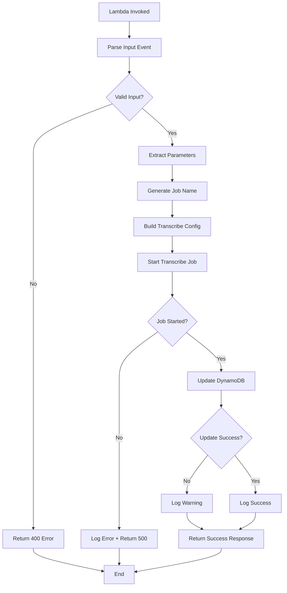

# Lambda Transcribe Starter Function - Technical Design

**Version**: 1.0  
**Date**: 2024-12-11  
**Status**: Design Phase  
**Author**: Kilo Code (Architect Mode)

---

## 1. Overview

### Purpose
The Transcribe Starter Function is responsible for initiating AWS Transcribe jobs to convert video audio into text with speaker identification. It serves as the second stage in the AI Techne Academy video processing pipeline.

### Position in Architecture
```
S3 Upload → [Trigger Function] → Step Functions → [Transcribe Starter] → Transcribe Job
                                                         ↓
                                                   DynamoDB Tracking
```

### Key Responsibilities
1. Receive execution context from Step Functions or direct invocation
2. Validate input parameters (S3 URIs, execution IDs)
3. Start AWS Transcribe job with optimized settings
4. Configure speaker identification (up to 10 speakers)
5. Update DynamoDB tracking table with job details
6. Return job information for workflow continuation

---

## 2. Function Specifications

### Runtime Configuration
```yaml
Runtime: Python 3.12
Timeout: 60 seconds
Memory: 256 MB
Handler: app.lambda_handler
IAM Role: LambdaExecutionRole (with Transcribe permissions)
```

### Environment Variables
| Variable | Description | Required | Default |
|----------|-------------|----------|---------|
| `TRACKING_TABLE` | DynamoDB table name | Yes | - |
| `OUTPUT_BUCKET` | S3 bucket for transcripts | Yes | - |
| `LANGUAGE_CODE` | Transcription language | No | `pt-BR` |
| `MAX_SPEAKERS` | Maximum speaker labels | No | `10` |
| `ENVIRONMENT` | Environment name | Yes | - |
| `LOG_LEVEL` | Logging level | No | `INFO` |

### AWS Service Permissions Required
- **Transcribe**: `StartTranscriptionJob`, `GetTranscriptionJob`
- **S3**: `GetObject` (input bucket), `PutObject` (output bucket)
- **DynamoDB**: `UpdateItem`, `GetItem`
- **CloudWatch Logs**: `CreateLogStream`, `PutLogEvents`

---

## 3. Input/Output Specifications

### Input Event Format

#### Option 1: Step Functions Input
```json
{
  "execution_id": "550e8400-e29b-41d4-a716-446655440000",
  "video_key": "videos/meeting-2024-12-11.mp4",
  "bucket": "ai-techne-academy-input-dev-615934053793",
  "metadata": {
    "filename": "meeting-2024-12-11.mp4",
    "size_mb": 1500.0,
    "s3_uri": "s3://bucket/videos/meeting-2024-12-11.mp4"
  },
  "timestamp": "2024-12-11T10:00:00.000Z"
}
```

#### Option 2: Direct Invocation
```json
{
  "execution_id": "uuid",
  "s3_uri": "s3://bucket/key",
  "language_code": "pt-BR",
  "max_speakers": 10
}
```

### Output Format

#### Success Response
```json
{
  "statusCode": 200,
  "body": {
    "status": "success",
    "execution_id": "550e8400-e29b-41d4-a716-446655440000",
    "transcription_job": {
      "job_name": "transcribe-550e8400-e29b-41d4-a716-446655440000",
      "job_status": "IN_PROGRESS",
      "language_code": "pt-BR",
      "media_uri": "s3://bucket/videos/meeting-2024-12-11.mp4",
      "output_location": "s3://transcripts-bucket/550e8400/transcript.json",
      "created_at": "2024-12-11T10:00:01.000Z"
    },
    "message": "Transcription job started successfully"
  }
}
```

#### Error Response
```json
{
  "statusCode": 400,
  "body": {
    "status": "error",
    "error": "InvalidInputError",
    "message": "Missing required parameter: execution_id",
    "details": {}
  }
}
```

---

## 4. Detailed Architecture

### 4.1 Function Flow



### 4.2 AWS Transcribe Configuration

```python
{
    "TranscriptionJobName": f"transcribe-{execution_id}",
    "Media": {
        "MediaFileUri": s3_uri
    },
    "MediaFormat": media_format,  # Extracted from file extension
    "LanguageCode": language_code,  # Default: pt-BR
    "OutputBucketName": output_bucket,
    "OutputKey": f"{execution_id}/",
    "Settings": {
        "ShowSpeakerLabels": True,
        "MaxSpeakerLabels": max_speakers,  # Default: 10
        "ChannelIdentification": False
    },
    "Tags": [
        {"Key": "Environment", "Value": environment},
        {"Key": "ExecutionId", "Value": execution_id},
        {"Key": "Project", "Value": "ai-techne-academy"}
    ]
}
```

### 4.3 Media Format Detection

Map file extensions to Transcribe MediaFormat values:

| Extension | MediaFormat | MIME Type |
|-----------|-------------|-----------|
| `.mp4` | `mp4` | video/mp4 |
| `.mp3` | `mp3` | audio/mpeg |
| `.wav` | `wav` | audio/wav |
| `.flac` | `flac` | audio/flac |
| `.ogg` | `ogg` | audio/ogg |
| `.webm` | `webm` | video/webm |
| `.amr` | `amr` | audio/amr |

---

## 5. DynamoDB Integration

### 5.1 Update Pattern

**Operation**: `UpdateItem` with conditional update

**Key**: `execution_id` (partition key)

**Update Expression**:
```python
UpdateExpression = """
    SET 
        #stages.#transcribe_starter = :stage_data,
        updated_at = :timestamp,
        #status = :status
"""
```

**Attribute Values**:
```python
{
    ":stage_data": {
        "status": "in_progress",
        "job_name": job_name,
        "job_status": "IN_PROGRESS",
        "timestamp": iso_timestamp,
        "language_code": language_code,
        "max_speakers": max_speakers,
        "media_uri": s3_uri,
        "output_location": output_s3_path
    },
    ":timestamp": iso_timestamp,
    ":status": "TRANSCRIBING"
}
```

### 5.2 Complete Record Structure After Update

```json
{
  "execution_id": "550e8400-e29b-41d4-a716-446655440000",
  "video_key": "s3://bucket/video.mp4",
  "status": "TRANSCRIBING",
  "created_at": "2024-12-11T10:00:00.000Z",
  "updated_at": "2024-12-11T10:00:01.000Z",
  "environment": "dev",
  "video_metadata": { /* from trigger */ },
  "processing_stages": {
    "trigger": {
      "status": "completed",
      "timestamp": "2024-12-11T10:00:00.000Z"
    },
    "transcribe_starter": {
      "status": "in_progress",
      "job_name": "transcribe-550e8400-...",
      "job_status": "IN_PROGRESS",
      "timestamp": "2024-12-11T10:00:01.000Z",
      "language_code": "pt-BR",
      "max_speakers": 10,
      "media_uri": "s3://bucket/video.mp4",
      "output_location": "s3://transcripts/550e8400/transcript.json"
    }
  }
}
```

---

## 6. Error Handling Strategy

### 6.1 Error Categories

| Category | HTTP Code | Action | Retry? |
|----------|-----------|--------|--------|
| **Input Validation** | 400 | Return error immediately | No |
| **Resource Not Found** | 404 | Return error immediately | No |
| **Transcribe Service Error** | 500 | Log and return error | Yes* |
| **DynamoDB Error** | 500 | Log warning, continue | Yes |
| **Throttling** | 429 | Exponential backoff | Yes |

*Step Functions will handle retry logic

### 6.2 Validation Rules

```python
VALIDATION_RULES = {
    "execution_id": {
        "required": True,
        "type": "uuid",
        "error": "Invalid or missing execution_id"
    },
    "s3_uri": {
        "required": True,
        "pattern": r"^s3://[a-z0-9\-]+/.+$",
        "error": "Invalid S3 URI format"
    },
    "language_code": {
        "required": False,
        "allowed": ["pt-BR", "en-US", "es-ES"],
        "default": "pt-BR"
    },
    "max_speakers": {
        "required": False,
        "type": "int",
        "range": [2, 10],
        "default": 10
    }
}
```

### 6.3 Exception Handling

```python
try:
    # Start transcription job
    response = transcribe_client.start_transcription_job(...)
except ClientError as e:
    error_code = e.response['Error']['Code']
    
    if error_code == 'ConflictException':
        # Job already exists
        logger.warning(f"Job already exists: {job_name}")
        # Check existing job status
        
    elif error_code == 'LimitExceededException':
        # Quota exceeded
        logger.error("Transcribe quota exceeded")
        raise
        
    elif error_code == 'BadRequestException':
        # Invalid parameters
        logger.error(f"Invalid request: {e}")
        return create_error_response(400, str(e))
        
    else:
        # Unknown error
        logger.error(f"Transcribe error: {e}")
        raise
```

---

## 7. Testing Strategy

### 7.1 Unit Test Cases

#### Test Suite 1: Input Parsing
```python
class TestInputParsing:
    def test_parse_step_functions_input(self):
        """Test parsing Step Functions event format"""
        
    def test_parse_direct_invocation_input(self):
        """Test parsing direct Lambda invocation"""
        
    def test_invalid_input_format(self):
        """Test handling of malformed input"""
        
    def test_missing_required_fields(self):
        """Test validation of required fields"""
```

#### Test Suite 2: Job Name Generation
```python
class TestJobNameGeneration:
    def test_generate_unique_job_name(self):
        """Test job name follows convention"""
        
    def test_job_name_length_limits(self):
        """Test job name within AWS limits (200 chars)"""
        
    def test_job_name_valid_characters(self):
        """Test job name uses valid characters only"""
```

#### Test Suite 3: Transcribe Configuration
```python
class TestTranscribeConfig:
    def test_build_config_with_defaults(self):
        """Test config with default values"""
        
    def test_build_config_with_custom_params(self):
        """Test config with custom parameters"""
        
    def test_media_format_detection(self):
        """Test correct media format from file extension"""
        
    def test_speaker_labels_configuration(self):
        """Test speaker identification settings"""
```

#### Test Suite 4: DynamoDB Updates
```python
class TestDynamoDBUpdates:
    def test_update_tracking_record(self):
        """Test successful DynamoDB update"""
        
    def test_handle_update_failure(self):
        """Test graceful handling of DynamoDB errors"""
        
    def test_conditional_update(self):
        """Test update only if record exists"""
```

#### Test Suite 5: Error Handling
```python
class TestErrorHandling:
    def test_handle_transcribe_quota_exceeded(self):
        """Test quota exceeded error handling"""
        
    def test_handle_invalid_s3_uri(self):
        """Test invalid S3 URI handling"""
        
    def test_handle_duplicate_job(self):
        """Test handling of duplicate job names"""
```

#### Test Suite 6: Lambda Handler
```python
class TestLambdaHandler:
    def test_successful_execution(self):
        """Test complete successful flow"""
        
    def test_execution_with_errors(self):
        """Test error scenarios"""
```

### 7.2 Integration Test Cases

1. **End-to-End Test**: Upload video → Trigger → Transcribe Starter → Verify job created
2. **DynamoDB Integration**: Verify tracking record updates correctly
3. **S3 Integration**: Verify access to input/output buckets
4. **Error Recovery**: Test retry logic with transient failures

### 7.3 Test Coverage Goals
- **Target**: >85% code coverage
- **Critical Paths**: 100% coverage
- **Error Handlers**: 100% coverage

---

## 8. Performance Considerations

### 8.1 Expected Metrics

| Metric | Target | Notes |
|--------|--------|-------|
| Cold Start | <3s | First invocation |
| Warm Execution | <500ms | Subsequent invocations |
| Memory Usage | <128MB | Actual usage |
| Concurrent Executions | 10 | Initial limit |

### 8.2 Optimization Strategies

1. **Connection Pooling**: Reuse boto3 clients
2. **Lazy Initialization**: Initialize resources only when needed
3. **Minimal Dependencies**: Only boto3 and botocore
4. **Structured Logging**: Use JSON format for better parsing

---

## 9. Monitoring and Observability

### 9.1 CloudWatch Metrics

**Custom Metrics**:
- `TranscribeJobsStarted` (Count)
- `TranscribeJobFailures` (Count)
- `FunctionDuration` (Milliseconds)
- `ValidationErrors` (Count)

### 9.2 Log Structure

```json
{
  "timestamp": "2024-12-11T10:00:01.000Z",
  "level": "INFO",
  "execution_id": "550e8400-...",
  "job_name": "transcribe-550e8400-...",
  "action": "start_transcription_job",
  "status": "success",
  "duration_ms": 245,
  "metadata": {
    "language_code": "pt-BR",
    "max_speakers": 10,
    "media_uri": "s3://bucket/video.mp4"
  }
}
```

### 9.3 CloudWatch Alarms

1. **High Error Rate**: >5% errors in 5 minutes
2. **Long Duration**: Execution time >10s
3. **Throttling**: Any throttled requests
4. **DynamoDB Errors**: >3 failed updates in 5 minutes

---

## 10. Security Considerations

### 10.1 IAM Least Privilege

```json
{
  "Version": "2012-10-17",
  "Statement": [
    {
      "Effect": "Allow",
      "Action": [
        "transcribe:StartTranscriptionJob",
        "transcribe:GetTranscriptionJob"
      ],
      "Resource": "*"
    },
    {
      "Effect": "Allow",
      "Action": ["s3:GetObject"],
      "Resource": "arn:aws:s3:::ai-techne-academy-input-*/*"
    },
    {
      "Effect": "Allow",
      "Action": ["s3:PutObject"],
      "Resource": "arn:aws:s3:::ai-techne-academy-transcripts-*/*"
    },
    {
      "Effect": "Allow",
      "Action": ["dynamodb:UpdateItem", "dynamodb:GetItem"],
      "Resource": "arn:aws:dynamodb:*:*:table/ai-techne-academy-tracking-*"
    }
  ]
}
```

### 10.2 Input Sanitization

- Validate all S3 URIs against allowed buckets
- Sanitize job names to prevent injection
- Validate UUIDs format
- Limit string lengths to prevent overflow

---

## 11. Implementation Checklist

### Phase 1: Core Implementation
- [ ] Create [`app.py`](src/functions/transcribe/app.py) with lambda_handler
- [ ] Implement input parsing and validation
- [ ] Implement job name generation
- [ ] Implement Transcribe configuration builder
- [ ] Implement start_transcription_job wrapper
- [ ] Implement DynamoDB update logic
- [ ] Implement error handling and logging

### Phase 2: Testing
- [ ] Create [`test_transcribe_starter.py`](tests/unit/test_transcribe_starter.py)
- [ ] Write unit tests for all functions
- [ ] Mock AWS services (boto3)
- [ ] Achieve >85% code coverage
- [ ] Test error scenarios

### Phase 3: Documentation
- [ ] Create [`README.md`](src/functions/transcribe/README.md)
- [ ] Document all functions
- [ ] Add usage examples
- [ ] Document environment variables
- [ ] Create troubleshooting guide

### Phase 4: Infrastructure
- [ ] Update [`template.yaml`](infrastructure/template.yaml)
- [ ] Add TranscribeStarterFunction resource
- [ ] Configure IAM permissions
- [ ] Add CloudWatch log group
- [ ] Add outputs for function ARN

### Phase 5: Validation
- [ ] Validate SAM template
- [ ] Test locally with SAM CLI
- [ ] Deploy to dev environment
- [ ] Run integration tests
- [ ] Verify CloudWatch logs and metrics

---

## 12. Future Enhancements

### Short Term
- Add support for custom vocabularies
- Implement content redaction for sensitive data
- Add subtitle format output options

### Long Term
- Multi-language detection and transcription
- Custom language models
- Real-time transcription support
- Enhanced speaker identification with speaker names

---

## 13. References

### AWS Documentation
- [AWS Transcribe Developer Guide](https://docs.aws.amazon.com/transcribe/)
- [Boto3 Transcribe Documentation](https://boto3.amazonaws.com/v1/documentation/api/latest/reference/services/transcribe.html)
- [Speaker Diarization](https://docs.aws.amazon.com/transcribe/latest/dg/diarization.html)

### Project Documentation
- [Project Specification](./SPECIFICATION.md)
- [Implementation Plan](./IMPLEMENTATION_PLAN.md)
- [Trigger Function README](../src/functions/trigger/README.md)

---

**Design Status**: ✅ Complete and Ready for Implementation  
**Next Step**: Switch to Code mode to implement the function  
**Estimated Implementation Time**: 2-3 hours