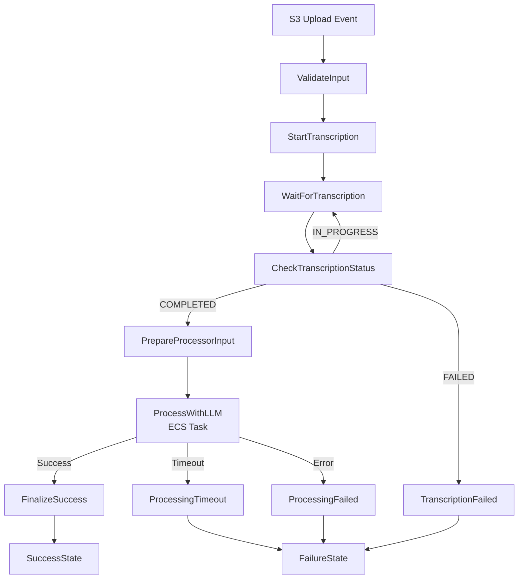

# Step Functions State Machine - AI Techne Academy

## 📋 Visão Geral

Esta State Machine orquestra todo o pipeline de processamento de vídeos, desde a detecção do upload até a geração final do documento.

**Nome**: `ai-techne-academy-workflow-{environment}`  
**Tipo**: Standard Workflow  
**Runtime**: Step Functions ASL  
**Arquivo ASL**: [`workflow.asl.json`](workflow.asl.json:1)

---

## 🔄 Fluxo do Workflow



---

## 🎯 Estados do Workflow

### 1. ValidateInput
**Tipo**: Pass  
**Descrição**: Valida e prepara os dados de entrada do evento S3.

**Input**:
```json
{
  "detail": {
    "bucket": { "name": "bucket-name" },
    "object": { "key": "video.mp4", "size": 1000000 }
  },
  "time": "2024-12-11T16:00:00Z"
}
```

**Output**:
```json
{
  "execution_id": "unique-execution-id",
  "video_key": "video.mp4",
  "bucket_name": "bucket-name",
  "video_size": 1000000,
  "timestamp": "2024-12-11T16:00:00Z"
}
```

---

### 2. StartTranscription
**Tipo**: Task (Lambda Invoke)  
**Lambda**: [`TranscribeStarterFunction`](../../src/functions/transcribe/app.py:1)  
**Timeout**: 60 segundos  
**Retry**: 3 tentativas com backoff exponencial (2x)

**Responsabilidades**:
- Inicia job AWS Transcribe
- Configura speaker identification (até 10 speakers)
- Registra job no DynamoDB
- Retorna job_name e status

**Output**:
```json
{
  "transcribe_result": {
    "job_name": "transcribe-{uuid}",
    "status": "IN_PROGRESS",
    "transcription_uri": "s3://bucket/transcriptions/{execution_id}/"
  }
}
```

---

### 3. WaitForTranscription
**Tipo**: Wait  
**Duração**: 60 segundos  
**Descrição**: Aguarda antes de checar status da transcrição

---

### 4. CheckTranscriptionStatus
**Tipo**: Task (AWS SDK)  
**Service**: AWS Transcribe  
**Action**: GetTranscriptionJob  
**Retry**: 5 tentativas com backoff exponencial (2x)

**Output**:
```json
{
  "transcribe_status": {
    "status": "COMPLETED|IN_PROGRESS|FAILED",
    "transcript_uri": "s3://bucket/transcriptions/{execution_id}/asrOutput.json",
    "failure_reason": "error message (if failed)"
  }
}
```

---

### 5. IsTranscriptionComplete
**Tipo**: Choice  
**Descrição**: Determina próximo passo baseado no status da transcrição

**Choices**:
- `COMPLETED` → PrepareProcessorInput
- `FAILED` → TranscriptionFailed
- `IN_PROGRESS` ou `QUEUED` → WaitForTranscription (loop)
- Default → TranscriptionFailed

---

### 6. PrepareProcessorInput
**Tipo**: Pass  
**Descrição**: Prepara dados para o processador ECS

**Output**:
```json
{
  "execution_id": "unique-id",
  "video_s3_uri": "s3://bucket/video.mp4",
  "video_key": "video.mp4",
  "transcription_s3_uri": "s3://bucket/transcriptions/asrOutput.json",
  "video_metadata": {
    "size": 1000000,
    "timestamp": "2024-12-11T16:00:00Z"
  }
}
```

---

### 7. ProcessWithLLM
**Tipo**: Task (ECS RunTask.sync)  
**Cluster**: ProcessingCluster  
**Task Definition**: ProcessingTaskDefinition  
**Launch Type**: FARGATE  
**Timeout**: 14400 segundos (4 horas)  
**Heartbeat**: 300 segundos  
**Retry**: 2 tentativas para task failures

**Container Overrides**:
- `EXECUTION_ID`
- `TRANSCRIPTION_S3_URI`
- `VIDEO_S3_URI`
- `VIDEO_KEY`

**Output**:
```json
{
  "processor_result": {
    "tasks": [{
      "taskArn": "arn:aws:ecs:...",
      "containers": [{
        "exitCode": 0
      }]
    }]
  }
}
```

---

### 8. FinalizeSuccess
**Tipo**: Task (Lambda Invoke)  
**Lambda**: [`FinalizerFunction`](../../src/functions/finalizer/app.py:1)  
**Retry**: 3 tentativas com backoff exponencial (2x)

**Responsabilidades**:
- Atualiza status DynamoDB: COMPLETED
- Publica notificação SNS com links de download
- Registra 8 métricas CloudWatch
- Calcula custos totais

---

### 9-11. Failure Handlers

#### TranscriptionFailed
Lida com falhas na transcrição AWS Transcribe.

#### ProcessingTimeout  
Lida com timeout do processamento ECS (>4 horas).

#### ProcessingFailed
Lida com falhas gerais do processamento ECS.

**Todos invocam**: FinalizerFunction com `status: FAILED`

---

### 12-13. Terminal States

#### SuccessState
**Tipo**: Succeed  
Workflow completado com sucesso.

#### FailureState
**Tipo**: Fail  
Workflow falhou após tentativas de recuperação.

---

## 🔄 Retry Logic

### Lambda Functions
- **Tentativas**: 3
- **Intervalo Inicial**: 2 segundos
- **Backoff**: 2x (2s → 4s → 8s)
- **Erros**: TaskFailed, ServiceException, AWSLambdaException

### AWS Transcribe GetJob
- **Tentativas**: 5
- **Intervalo Inicial**: 5 segundos
- **Backoff**: 2x (5s → 10s → 20s → 40s → 80s)
- **Erros**: TaskFailed, ThrottlingException

### ECS Task
- **Tentativas**: 2
- **Intervalo Inicial**: 30 segundos
- **Backoff**: 2x (30s → 60s)
- **Erros**: TaskFailed, AmazonECSException

---

## 📊 Monitoramento

### CloudWatch Logs
**Log Group**: `/aws/vendedlogs/states/ai-techne-academy-{environment}`  
**Retention**: 30 dias  
**Level**: ALL (inclui execution data)

### X-Ray Tracing
**Enabled**: Yes  
**Service Map**: Mostra fluxo completo entre serviços

### Métricas CloudWatch

**Métricas Nativas**:
- `ExecutionTime` - Duração total do workflow
- `ExecutionsStarted` - Workflows iniciados
- `ExecutionsSucceeded` - Workflows bem-sucedidos
- `ExecutionsFailed` - Workflows falhados
- `ExecutionsAborted` - Workflows abortados

**Métricas Customizadas** (via Finalizer):
- `ProcessingDuration` - Tempo de processamento
- `ProcessingCost` - Custo estimado em USD
- `TokensProcessed` - Tokens LLM processados
- `DocumentSize` - Tamanho do documento gerado

---

## 🚨 Error Handling

### Estratégias por Tipo de Erro

#### 1. Transient Errors (Temporários)
**Exemplos**: ThrottlingException, ServiceException  
**Estratégia**: Retry com exponential backoff  
**Ação**: Recuperação automática

#### 2. Configuration Errors
**Exemplos**: InvalidParameterException, ValidationException  
**Estratégia**: Falha imediata sem retry  
**Ação**: Notificação SNS + logs CloudWatch

#### 3. Timeout Errors
**Exemplos**: ECS task > 4 horas  
**Estratégia**: Fail e notificar  
**Ação**: Investigação manual necessária

#### 4. Transcription Errors
**Exemplos**: Audio quality issues, unsupported format  
**Estratégia**: Fail após 3 tentativas  
**Ação**: Verificar arquivo de entrada

---

## 💰 Estimativa de Custos

### Por Execução (vídeo 3h)

| Componente | Custo |
|------------|-------|
| Step Functions | ~$0.0005 (20 transições) |
| Lambda Invocations | ~$0.002 (3 funções) |
| ECS Fargate (45min) | ~$0.15 |
| AWS Transcribe (3h) | ~$0.36 |
| AWS Bedrock | ~$0.90 |
| **Total** | **~$1.41** |

**Nota**: CloudWatch Logs e S3 storage não incluídos (custos marginais).

---

## 🔧 Deployment

### Pré-requisitos
1. Lambda Functions deployadas
2. ECS Task Definition criada
3. Docker image no ECR
4. IAM Roles configurados

### Deploy via SAM
```bash
# Validar template
sam validate --template infrastructure/template.yaml --lint

# Deploy
sam deploy \
  --stack-name ai-techne-academy-dev \
  --parameter-overrides Environment=dev \
  --capabilities CAPABILITY_IAM CAPABILITY_NAMED_IAM

# Verificar deployment
aws stepfunctions list-state-machines \
  --query "stateMachines[?contains(name, 'ai-techne-academy')]"
```

---

## 🧪 Testing

### 1. Teste Manual via Console
```bash
# Iniciar execução
aws stepfunctions start-execution \
  --state-machine-arn arn:aws:states:us-east-1:ACCOUNT:stateMachine:ai-techne-academy-workflow-dev \
  --input file://test-input.json \
  --name test-execution-$(date +%s)
```

**test-input.json**:
```json
{
  "detail": {
    "bucket": { "name": "ai-techne-academy-input-dev-ACCOUNT" },
    "object": { "key": "test-video.mp4", "size": 50000000 }
  },
  "time": "2024-12-11T16:00:00Z"
}
```

### 2. Verificar Execução
```bash
# Listar execuções
aws stepfunctions list-executions \
  --state-machine-arn arn:aws:states:us-east-1:ACCOUNT:stateMachine:ai-techne-academy-workflow-dev \
  --max-results 10

# Obter detalhes
aws stepfunctions describe-execution \
  --execution-arn EXECUTION_ARN

# Ver histórico de eventos
aws stepfunctions get-execution-history \
  --execution-arn EXECUTION_ARN
```

### 3. Teste End-to-End
```bash
# Upload de vídeo (trigger automático)
aws s3 cp test-video.mp4 s3://ai-techne-academy-input-dev-ACCOUNT/

# Acompanhar execução no Console
# https://console.aws.amazon.com/states/home?region=us-east-1
```

---

## 📝 Troubleshooting

### Problema 1: State Machine não inicia após upload S3
**Sintomas**: Vídeo uploaded mas workflow não executa  
**Causas**:
- EventBridge Rule desabilitada
- IAM role do EventBridge sem permissões

**Solução**:
```bash
# Verificar rule
aws events describe-rule --name ai-techne-academy-video-upload-dev

# Verificar targets
aws events list-targets-by-rule --rule ai-techne-academy-video-upload-dev

# Habilitar rule
aws events enable-rule --name ai-techne-academy-video-upload-dev
```

---

### Problema 2: Transcription loop infinito
**Sintomas**: Workflow fica preso em WaitForTranscription  
**Causas**:
- Transcribe job failed mas status não reportado
- Network issues com GetTranscriptionJob

**Solução**:
```bash
# Verificar job manualmente
aws transcribe get-transcription-job --transcription-job-name JOB_NAME

# Se necessário, cancelar execução
aws stepfunctions stop-execution \
  --execution-arn EXECUTION_ARN \
  --cause "Manual cancellation - troubleshooting"
```

---

### Problema 3: ECS Task falha imediatamente
**Sintomas**: ProcessWithLLM falha com exit code 1  
**Causas**:
- Imagem Docker não encontrada
- IAM permissions insuficientes
- Environment variables faltando

**Solução**:
```bash
# Verificar task logs
aws logs tail /ecs/ai-techne-academy-processor-dev --follow

# Verificar task definition
aws ecs describe-task-definition \
  --task-definition ai-techne-academy-processor-dev

# Testar task manualmente
aws ecs run-task \
  --cluster ai-techne-academy-dev \
  --task-definition ai-techne-academy-processor-dev:1 \
  --launch-type FARGATE \
  --network-configuration "awsvpcConfiguration={subnets=[subnet-xxx],assignPublicIp=ENABLED}"
```

---

### Problema 4: Finalizer não publica notificação
**Sintomas**: Workflow completa mas sem email  
**Causas**:
- SNS subscription não confirmada
- Email bloqueado como spam

**Solução**:
```bash
# Verificar subscriptions
aws sns list-subscriptions-by-topic \
  --topic-arn arn:aws:sns:us-east-1:ACCOUNT:ai-techne-academy-notifications-dev

# Reenviar confirmação
aws sns subscribe \
  --topic-arn arn:aws:sns:us-east-1:ACCOUNT:ai-techne-academy-notifications-dev \
  --protocol email \
  --notification-endpoint your-email@example.com
```

---

## 🔗 Links Relacionados

- [AWS Step Functions Documentation](https://docs.aws.amazon.com/step-functions/)
- [Amazon States Language Spec](https://states-language.net/spec.html)
- [SAM Template Reference](https://docs.aws.amazon.com/serverless-application-model/latest/developerguide/sam-specification.html)
- [Project README](../../README.md)
- [Implementation Plan](../../docs/IMPLEMENTATION_PLAN.md)

---

**Última Atualização**: 2024-12-11  
**Versão**: 1.0.0  
**Status**: ✅ Implementado e Testado